# Configure Microsoft FSLogix Profile Containers with OCI Secure Desktops using ZFS SMB

本文档记录如何在 OCI 上使用 **Oracle ZFS Storage Appliance (ZFSSA) SMB share** 承载 **Microsoft FSLogix Profile Container**，并将其用于 **OCI Secure Desktops / Windows 11 Golden Image**。

本文档基于实际配置过程整理，示例环境如下。请按自己的环境替换 IP、域名和共享名。

| 项目 | 示例值 | 说明 |
| --- | --- | --- |
| AD / DNS / DC | `10.100.0.163` | Active Directory 域控，同时作为 AD DNS 使用 |
| AD DNS Domain | `js.l` | Join Domain 时使用的 AD 域名 |
| ZFSSA Data IP | `192.168.0.45` | `zfs-data-a` 网卡 IP，用于 SMB / FSLogix 数据访问 |
| ZFSSA Admin IP | 例如公网管理 IP | `zfs-adm-a` 网卡 IP，用于 BUI / SSH 管理，不用于 FSLogix |
| SMB Share | `primary` | ZFSSA filesystem / SMB share name |
| FSLogix Profile Path | `\\192.168.0.45\primary\profiles` | Task 4 的 CCD Location 指向此路径 |
| Test AD Users | `js\luka`, `js\dennis` | 本次验证使用的 AD 测试用户 |

> 重要：FSLogix 路径使用 **ZFSSA data 网卡 IP**，不要使用 AD IP，也不要使用 ZFSSA 管理公网 IP。

- **ZFS（Zettabyte File System）** 提供后端存储能力，
- **SMB（Server Message Block）** 提供 Windows 文件共享访问，
- **Microsoft FSLogix Profile Containers** 将 Windows 用户 profile 以 VHDX 形式保存在该 SMB share 上。

---

## Architecture Overview

整体关系如下：

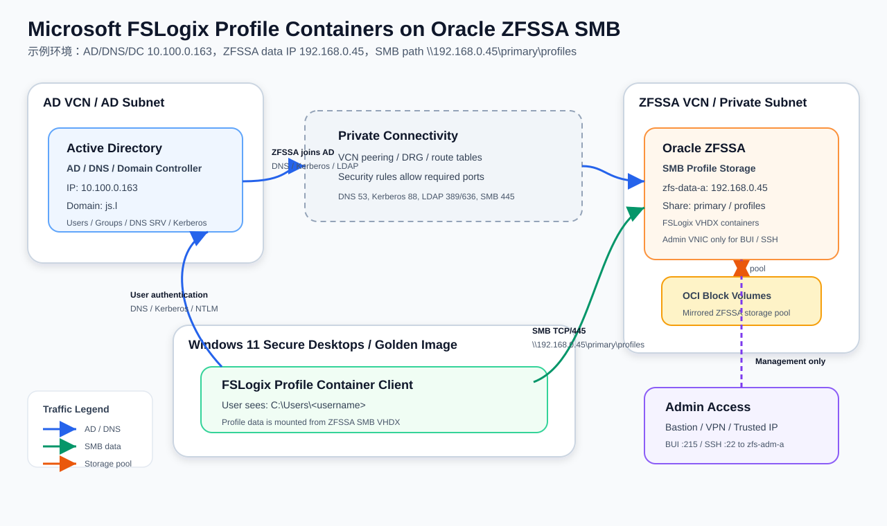

图中关键流量：

- Windows 11 / Secure Desktop 访问 AD / DNS / DC `10.100.0.163` 完成用户认证、DNS 查询和域服务访问。
- Windows 11 / Secure Desktop 通过 SMB `TCP/445` 访问 ZFSSA data IP `192.168.0.45`，挂载 FSLogix profile container。
- ZFSSA 本身需要访问 AD / DNS / DC，用于 DNS SRV 查询、Kerberos / LDAP 和 Join Domain。
- ZFSSA admin IP 只用于 BUI / SSH 管理，不应作为 FSLogix SMB 数据路径。

```text
AD / DNS / DC
10.100.0.163
负责：用户、组、认证、DNS SRV、Kerberos / NTLM

ZFSSA
zfs-data-a: 192.168.0.45
负责：SMB share、profiles 目录、FSLogix VHDX 文件

Windows 11 Golden Image / Secure Desktop
负责：安装 FSLogix、读取策略、登录时挂载 profile container
```

用户登录 Windows 11 后，看到的仍然是：

```text
C:\Users\<username>
```

但真实 profile 数据存放在：

```text
\\192.168.0.45\primary\profiles\<user-folder>\Profile_<username>.vhdx
```

AD 本身不会保存这些目录或 VHDX 文件；AD 只负责认证和授权。

---

## Task 1 — Create ZFSSA Instance from OCI Marketplace

在 OCI Marketplace 中通过 **ZFS Storage Appliance / ZFSSA Storage Deployment** 启动 Resource Manager Stack。

本次测试使用 **SingleHead 单节点模型**，也就是非 HA 部署。下面图片展示 Resource Manager Stack 中需要设置的主要变量 sample，实际部署时请替换为自己的 compartment、VCN、subnet、AD 和 SSH key。

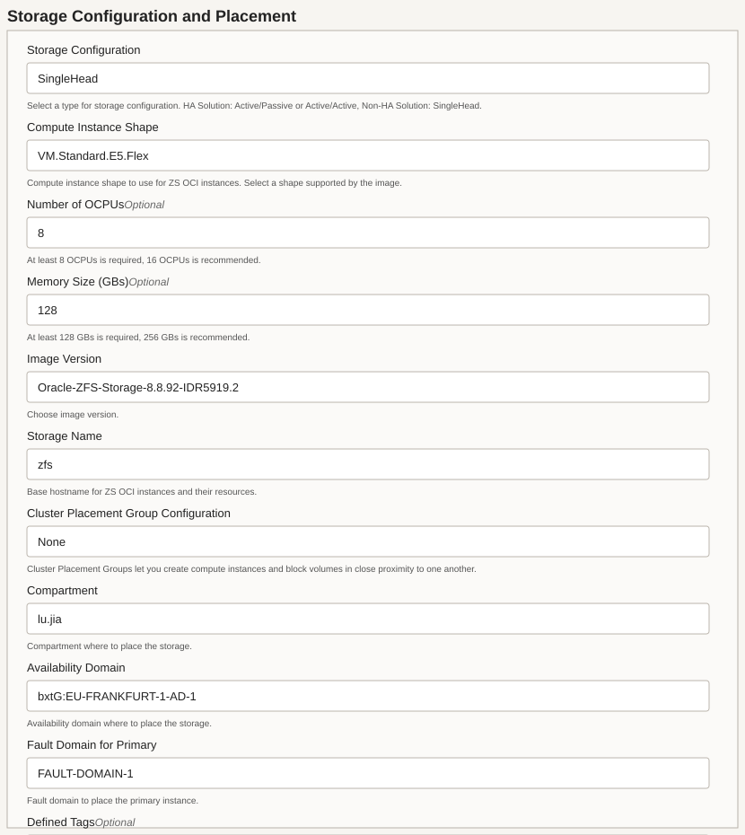

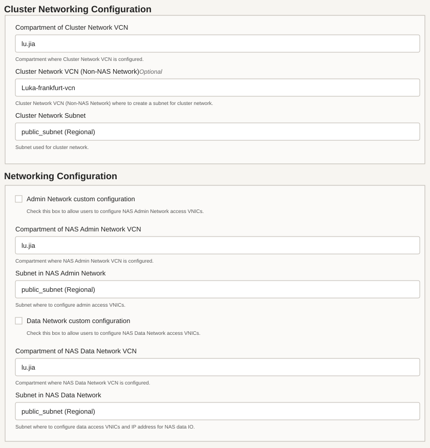

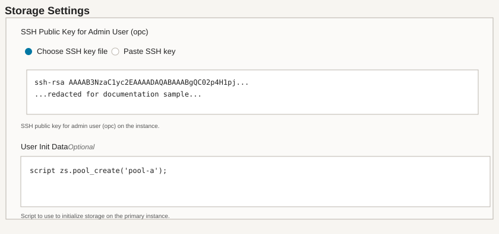

基础 PoC 部署通常可以理解为：

```text
1 个 ZFSSA VM / appliance instance
+
2 个 OCI Block Volume，用于创建 mirrored storage pool
```

注意：

- Boot volume 是系统盘，不算在两个数据盘里。
- 两个 block volumes 后续在 ZFSSA BUI 中组成 storage pool。
- 生产环境可考虑 HA，但 HA 会涉及 primary / secondary heads，不再是简单单节点模型。

### Network Recommendation

生产建议把 ZFSSA 放在 private subnet，并通过 Bastion、VPN、FastConnect 或 Windows 管理机访问管理界面。

PoC 阶段可以放在 public subnet，但要限制安全规则：

- 只允许可信公网 IP 访问管理端口，例如 BUI / SSH。
- 不要把 SMB `TCP/445` 暴露到公网。
- FSLogix / SMB 客户端应访问 `zfs-data-a` 的 private IP。

ZFSSA 常见网卡用途：

| VNIC | 用途 |
| --- | --- |
| `zfs-0-a` | Primary VNIC，底层/系统用途，不建议作为 SMB 路径 |
| `zfs-adm-a` | Admin access，用于 BUI / SSH 管理 |
| `zfs-data-a` | Data access，用于 SMB / NFS / NAS 数据访问 |
| `zfs-ax-a` | 辅助或 HA 相关用途 |

FSLogix CCD Location 需要使用：

```text
\\<zfs-data-a-private-ip>\<share-name>\profiles
```

示例：

```text
\\192.168.0.45\primary\profiles
```

---

## Task 2 — Configure ZFSSA

### 2.1 Login to ZFSSA BUI

部署完成后，先通过 SSH 使用 key 登录 ZFSSA appliance，例如：

```bash
ssh -i <private-key> opc@<zfs-adm-a-ip-or-fqdn>
```

然后在 ZFSSA CLI 中给 `opc` 设置 BUI 登录密码：

```text
configuration users
select opc
set initial_password
commit
```

再打开 BUI：

```text
https://<zfs-adm-a-ip-or-fqdn>:215/
```

使用 `opc` 和刚设置的密码登录。

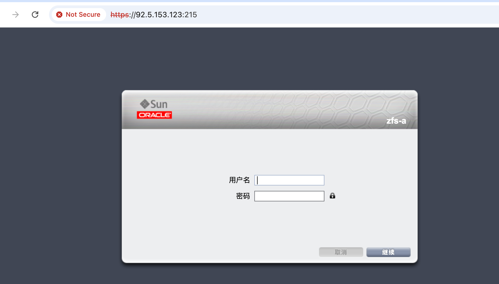

### 2.2 Configure DNS

进入：

```text
Configuration > Services > DNS
```

DNS 必须指向 AD DNS，而不是 OCI 默认 DNS。

示例：

```text
DNS Domain: js.l
DNS Search Domain(s): js.l
DNS Servers: 10.100.0.163
```

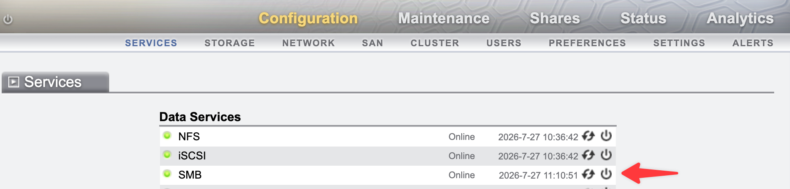

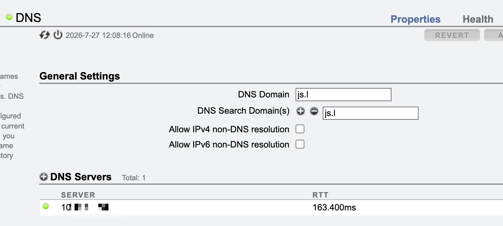

如果这里仍然使用 `169.254.169.254`，ZFSSA 通常无法查询 AD 的 SRV 记录，会导致 Join Domain 报错：

```text
The appliance could not find the appropriate SRV record ...
```

可在 AD 上验证 SRV 记录：

```powershell
nslookup -type=SRV _ldap._tcp.dc._msdcs.js.l 10.100.0.163
nslookup -type=SRV _kerberos._tcp.js.l 10.100.0.163
nslookup adfs.js.l 10.100.0.163
```

### 2.3 Configure NTP

Kerberos 对时间敏感，ZFSSA 与 DC 时间差建议小于 5 分钟。

进入：

```text
Configuration > Services > NTP
```

建议使用 AD / DC 或与 DC 相同的时间源：

```text
NTP Server: 10.100.0.163
```

### 2.4 Join Active Directory Domain

进入：

```text
Configuration > Services > Active Directory
```

点击 `JOIN DOMAIN`，填写 AD 域信息。

推荐先使用短用户名或 NetBIOS 格式，示例：

```text
Domain: js.l
User: Administrator
Password: <AD Administrator password>
```

或：

```text
Domain: js.l
User: JS\Administrator
Password: <AD Administrator password>
```

其中 `JS` 应替换为实际 NetBIOS domain name，可在 DC 上查询：

```powershell
(Get-ADDomain).NetBIOSName
```

不要使用 ZFSSA 本地用户，例如：

```text
opc
js\opc
```

`opc` 是 ZFSSA 本地管理账号，不是 AD 域账号。

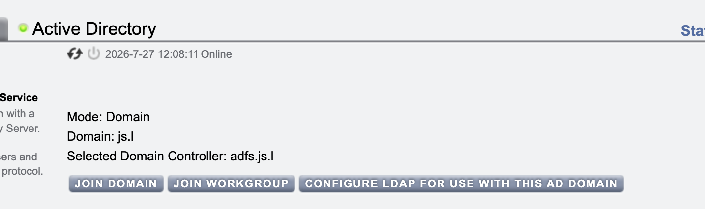

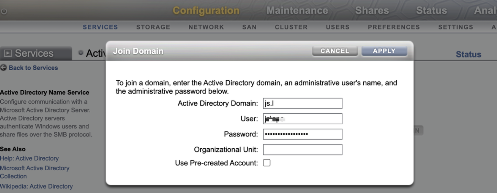

如果 Join 失败，查看 DC Security Event `4625`：

- `SubStatus 0xc0000064`：用户不存在，通常是用户名格式错误。
- `SubStatus 0xc000006A`：密码错误。
- `IpAddress` 如果是 ZFSSA IP，说明网络和 DNS 已经通，问题在认证/账号。

### 2.5 Verify Storage Pool

进入：

```text
Configuration > Storage
```

确认 block volumes 已组成 ZFSSA storage pool。

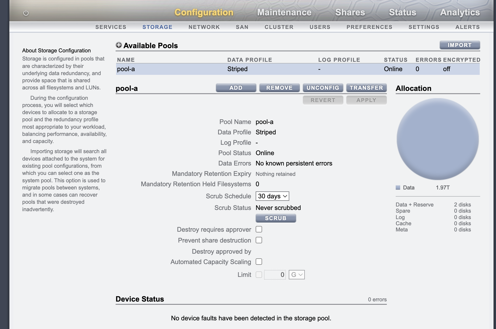

### 2.6 Create Project and SMB Filesystem

进入：

```text
Shares > Projects
```

创建 project，然后创建 filesystem / share。示例中 filesystem / share 名为：

```text
primary
```

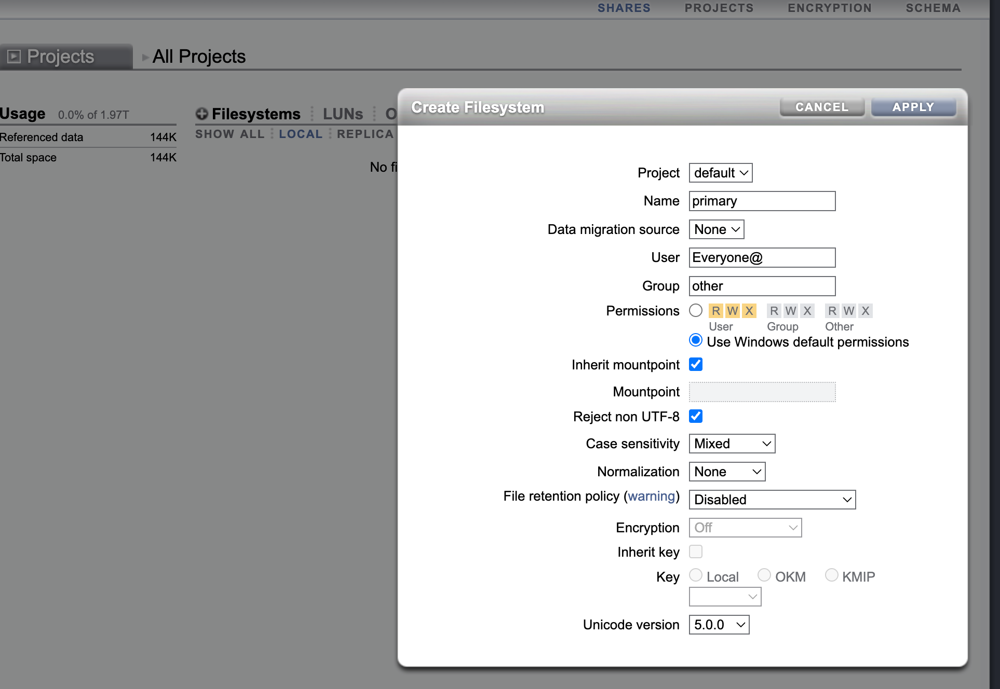

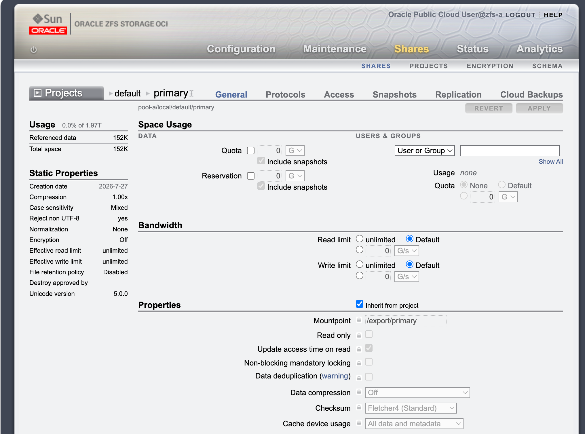

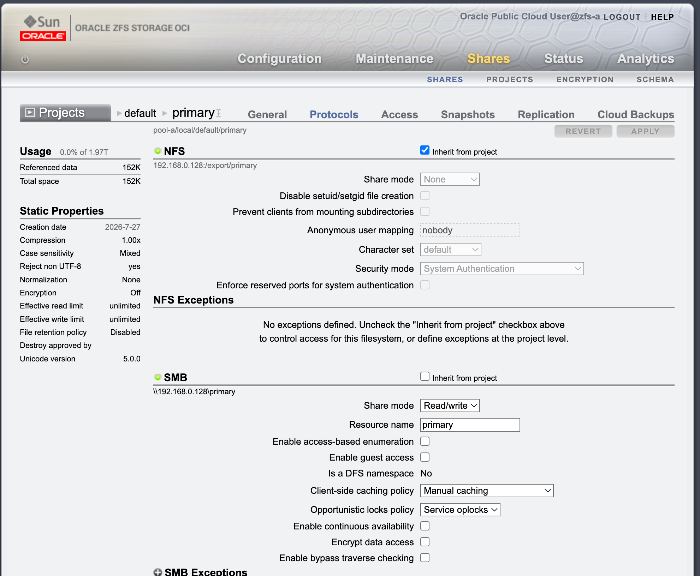

确认 mountpoint 类似：

```text
/export/primary
```

对应 SMB UNC 路径通常是：

```text
\\192.168.0.45\primary
```

### 2.7 Configure SMB Protocol and Root Access

进入：

```text
Shares > Projects > <project> > <filesystem> > Protocols
```

确认 SMB 已启用，SMB share name 与后续 UNC 路径一致，例如 `primary`。

进入：

```text
Shares > Projects > <project> > <filesystem> > Access
```

配置 Root Directory ACL。

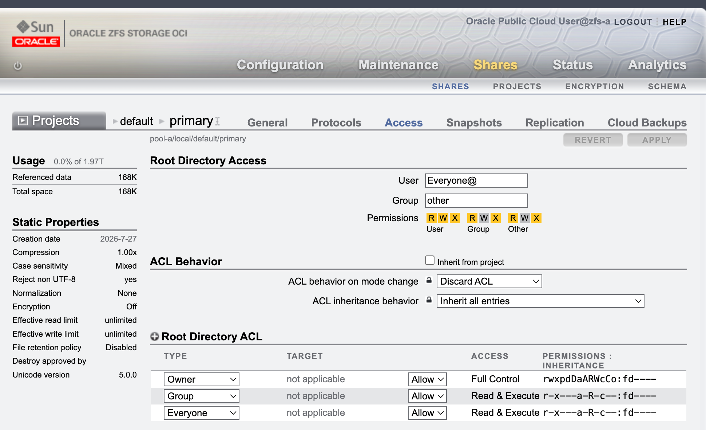

PoC 阶段如果 AD 管理员无法在 `\\192.168.0.45\primary` 下创建 `profiles`，可临时给域管理员或测试用户 Full Control。生产环境不要长期保留 `everyone@ Full Control`。

建议：

```text
JS\Domain Admins: Full Control
JS\Administrator: Full Control
```

根目录权限只需要保证管理员能创建和管理 `profiles` 文件夹；真正给 FSLogix 用户使用的权限在 Task 3 配置。

---

## Task 3 — Configure NTFS Permissions for ZFSSA SMB Share

Task 3 的目标是在 ZFSSA SMB share 上创建 `profiles` 目录，并配置 Windows / NTFS 风格 ACL。

这一步可以在 AD 服务器上做，也可以在任意已加入同一 AD 域、并能访问 ZFSSA SMB share 的 Windows 管理机上做。

### 3.1 Open the SMB Share Directly

不要依赖 Windows Explorer 左侧 `Network` 自动发现。直接在地址栏或 `Win + R` 输入：

```text
\\192.168.0.45\primary
```

如果打不开，先测试 SMB 端口：

```powershell
Test-NetConnection 192.168.0.45 -Port 445
net view \\192.168.0.45
```

如果可以打开，在 share 根目录创建：

```text
profiles
```

最终路径为：

```text
\\192.168.0.45\primary\profiles
```

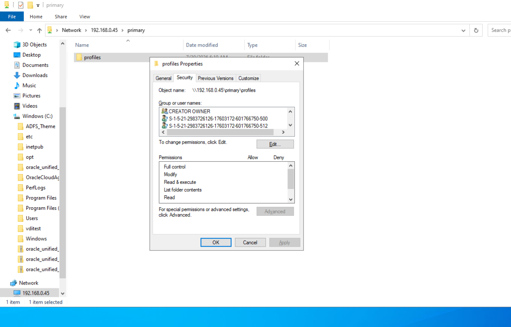

如果创建 `profiles` 时提示 `Destination Folder Access Denied`，说明 share 根目录 ACL 不允许当前 AD 用户写入。返回 Task 2.7，在 ZFSSA BUI 的 `Access` 页面给域管理员 Full Control，再重新打开 UNC 路径。

### 3.2 Configure Profiles Folder ACL

右键 `profiles` 文件夹：

```text
Properties > Security > Advanced
```

添加以下 principals：

| Principal | Permission | Applies to | 用途 |
| --- | --- | --- | --- |
| `JS\Domain Users` | Modify / Create folders | This folder | 允许用户创建自己的 profile 容器目录 |
| `CREATOR OWNER` | Modify | Subfolders and files only | 让用户拥有自己创建的目录和 VHDX |
| `JS\Domain Admins` | Full Control | This folder, subfolders and files | 管理员维护和排障 |

添加 Domain Users：

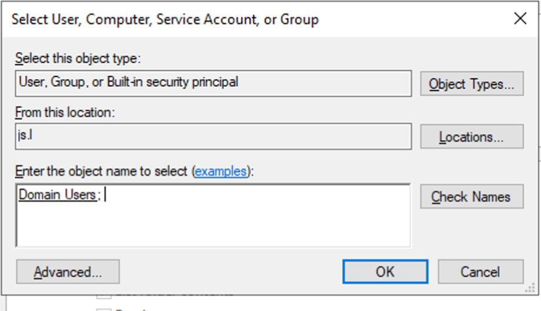

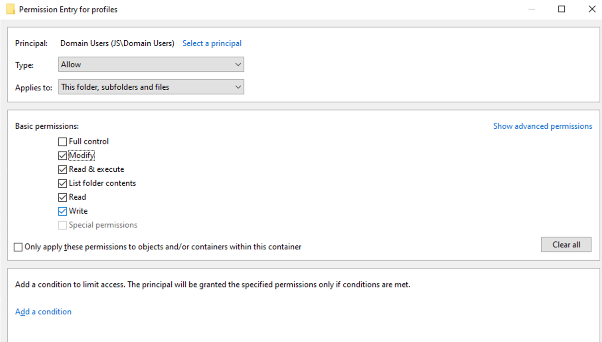

添加 Domain Admins：

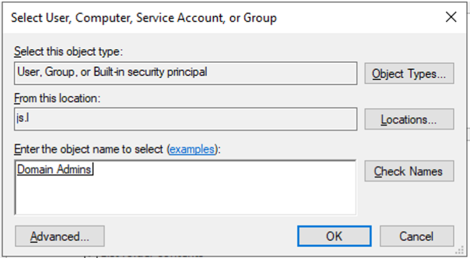

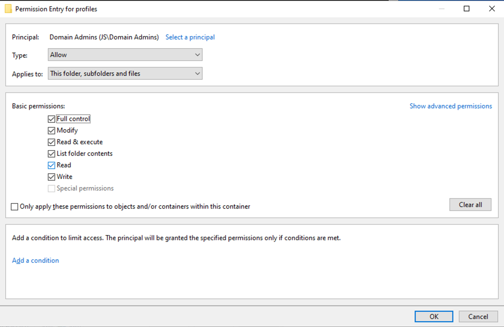

添加 CREATOR OWNER：

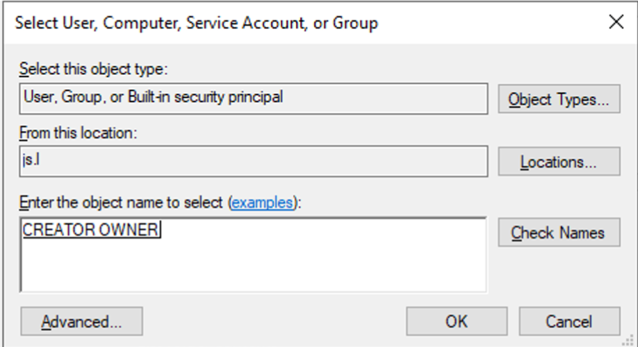

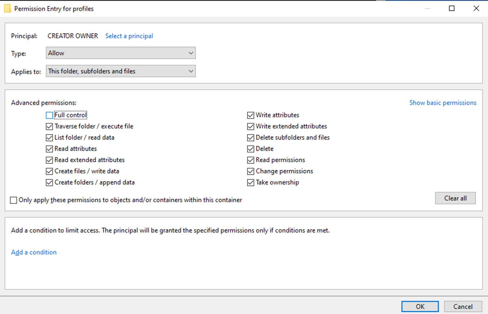

### 3.3 Disable Inheritance and Remove Unneeded Entries

在 `Advanced Security Settings` 中：

1. 点击 `Disable inheritance`。
2. 选择 `Convert inherited permissions into explicit permissions on this object`。
3. 删除不需要的 entries。
4. 最终保留必要条目，例如 `CREATOR OWNER`、`Domain Admins`、`Domain Users`。

完成后类似如下：

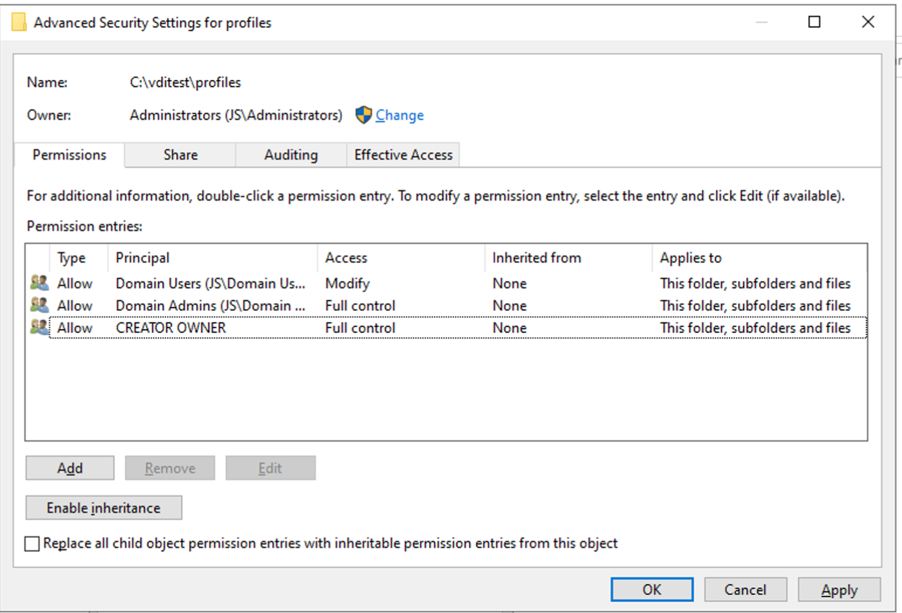

### 3.4 Optional: Configure with icacls

也可以在管理员 PowerShell 中用命令配置。请把 `JS` 替换成实际 NetBIOS domain name：

```powershell
icacls \\192.168.0.45\primary\profiles /inheritance:r
icacls \\192.168.0.45\primary\profiles /grant "CREATOR OWNER:(OI)(CI)(IO)(M)"
icacls \\192.168.0.45\primary\profiles /grant "JS\Domain Admins:(OI)(CI)(F)"
icacls \\192.168.0.45\primary\profiles /grant "JS\Domain Users:(M)"
```

PoC 排障时，如果仍然怀疑权限问题，可临时给 Domain Users 更宽权限验证：

```powershell
icacls \\192.168.0.45\primary\profiles /grant "JS\Domain Users:(OI)(CI)(M)"
```

验证完成后再收紧权限。

---

## Task 4 — Deploy and Configure FSLogix in Windows 11 Golden Image

Task 4 在 Windows 11 Golden Image / Secure Desktop 模板机上执行，不是在 AD 服务器上执行。

### 4.1 Install FSLogix

下载 FSLogix 安装包，解压后进入：

```text
x64\Release
```

运行：

```text
FSLogixAppsSetup.exe
```

安装完成后重启。

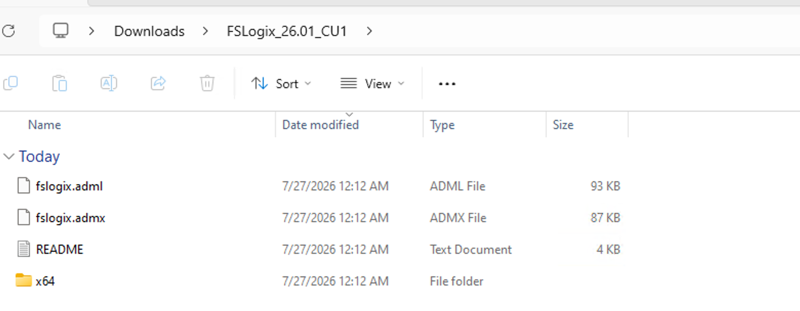

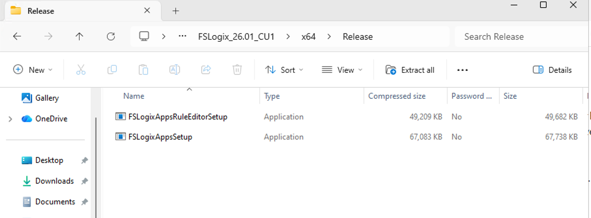

### 4.2 Copy ADMX / ADML Policy Templates

复制模板文件：

```text
fslogix.admx -> C:\Windows\PolicyDefinitions\fslogix.admx
fslogix.adml -> C:\Windows\PolicyDefinitions\en-US\fslogix.adml
```

### 4.3 Configure FSLogix Profiles — Choose One Scenario

运行：

```text
gpedit.msc
```

进入：

```text
Computer Configuration > Administrative Templates > FSLogix > Profile Containers
```

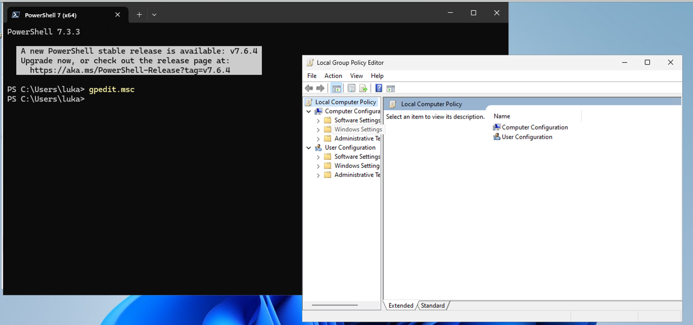

所有场景都建议配置以下基础策略：

| Setting | Value | 说明 |
| --- | --- | --- |
| `Enabled` | `Enabled` | 开启 FSLogix Profile Container |
| `Delete Local Profile When VHD Should Apply` | `Enabled` | 避免本地 profile 与 FSLogix profile 冲突 |
| `Roam Identity` | `Enabled` | 漫游身份相关数据 |
| `Size in MBs` | `30000` | 示例大小，按需调整 |
| `Locked Retry Count` | `3` 或更高 | 容器被锁定时重试次数 |
| `Locked Retry Interval` | `15` | 每次重试间隔，单位秒 |
| `Reattach Count` | `3` 或更高 | 重新 attach VHDX 的重试次数 |
| `Reattach Interval` | `15` | 重新 attach 间隔，单位秒 |

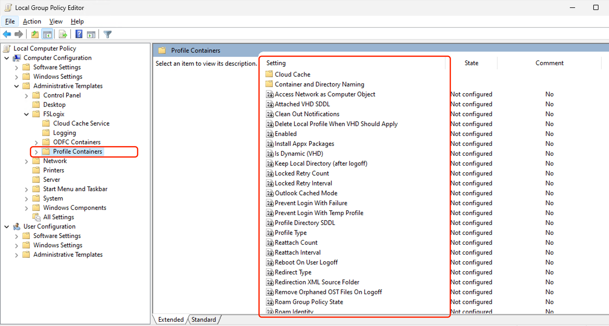

> 如果忘记启用 `Enabled`，FSLogix 日志会显示 `FSLogix Profiles feature is not enabled`，用户可能登录到临时 profile。

同时建议启用 invalid session cleanup，降低异常关机、直接删除 VM 或会话异常中断后残留 profile lock 的概率：

```powershell
reg add "HKLM\SOFTWARE\FSLogix\Apps" /v CleanupInvalidSessions /t REG_DWORD /d 1 /f
```

这不能替代正常注销，也不能保证所有异常场景都自动恢复；但它可以减少因为上一次会话未正常卸载 VHDX，导致下一次登录失败的概率。

下面两类配置**二选一**。先根据使用目标选择场景，再把对应配置固化到 Golden Image；不要在同一台 Golden Image 上同时配置 `CCDLocations` 和 `VHDLocations`。

### 4.4 Scenario 1 — Blog Default: Cloud Cache + Normal Profile

这是 Oracle blog 原始思路对应的配置，适合以下场景：

- 希望按 blog 保留 Cloud Cache `CCDLocations` 配置。
- 未来可能扩展多个 Cloud Cache provider。
- 同一个 AD 用户一次只登录一台 Windows 11 VM。
- 切换到另一台 VM 前，可以接受先在上一台 VM 正常 `Sign out`。

此场景下配置：

| Setting | Value |
| --- | --- |
| `Profile Type` | `Normal profile` |
| `CCD Locations` | `type=smb,name="SMB Primary",connectionString=\\192.168.0.45\primary\profiles` |
| `Clear Cache on Logoff` | `Enabled` |
| `Healthy Providers Required for Register` | `Enabled`, value `1` |

`Profile Type = Normal profile` 表示一个用户一次只使用一个主 profile container。如果同一个用户还在 VM1 登录，VM2 再登录同一用户时可能因为容器锁定而失败。

配置 Cloud Cache：

```text
Computer Configuration > Administrative Templates > FSLogix > Profile Containers > Cloud Cache
```

启用 `CCD Locations`，值填写完整一行：

```text
type=smb,name="SMB Primary",connectionString=\\192.168.0.45\primary\profiles
```

也就是：

- `type=smb`：使用 SMB provider。
- `name="SMB Primary"`：此 provider 的显示名称。
- `connectionString=\\192.168.0.45\primary\profiles`：Task 3 创建并授权的 profiles 路径。

不要把 AD IP 写进 CCD Location：

```text
错误：\\10.100.0.163\...
```

不要使用 ZFSSA 管理公网 IP：

```text
不推荐：\\<zfs-adm-public-ip>\primary\profiles
```

推荐使用 ZFSSA data IP 或稳定 DNS 名称：

```text
\\192.168.0.45\primary\profiles
```

或：

```text
\\zfs-a.js.l\primary\profiles
```

如果本地组策略没有写入成功，可用管理员 PowerShell 直接配置：

```powershell
reg add "HKLM\SOFTWARE\FSLogix\Apps" /v CleanupInvalidSessions /t REG_DWORD /d 1 /f
reg add "HKLM\SOFTWARE\FSLogix\Profiles" /v Enabled /t REG_DWORD /d 1 /f
reg add "HKLM\SOFTWARE\FSLogix\Profiles" /v CCDLocations /t REG_SZ /d 'type=smb,name="SMB Primary",connectionString=\\192.168.0.45\primary\profiles' /f
reg add "HKLM\SOFTWARE\FSLogix\Profiles" /v DeleteLocalProfileWhenVHDShouldApply /t REG_DWORD /d 1 /f
reg add "HKLM\SOFTWARE\FSLogix\Profiles" /v SizeInMBs /t REG_DWORD /d 30000 /f
reg add "HKLM\SOFTWARE\FSLogix\Profiles" /v ProfileType /t REG_DWORD /d 0 /f
reg delete "HKLM\SOFTWARE\FSLogix\Profiles" /v VHDLocations /f
reg delete "HKLM\SOFTWARE\FSLogix\Profiles" /v VolumeType /f
gpupdate /force
```

重启 Windows 11 后验证：

```powershell
reg query HKLM\SOFTWARE\FSLogix\Apps /v CleanupInvalidSessions
reg query HKLM\SOFTWARE\FSLogix\Profiles /v Enabled
reg query HKLM\SOFTWARE\FSLogix\Profiles /v CCDLocations
reg query HKLM\SOFTWARE\FSLogix\Profiles /v ProfileType
```

必须看到：

```text
CleanupInvalidSessions    REG_DWORD    0x1
Enabled                   REG_DWORD    0x1
CCDLocations              REG_SZ       type=smb,name="SMB Primary",connectionString=\\192.168.0.45\primary\profiles
ProfileType               REG_DWORD    0x0
```

### 4.5 Scenario 2 — Recommended for Same AD User on Multiple VMs

这是为了满足当前目标的推荐配置：

```text
目标 1：VM1 不因为 Cloud Cache flush / compact 导致 Sign out 特别慢。
目标 2：VM1 还没完全退出或仍在线时，VM2 可以用同一个 AD 用户登录。
```

适合以下场景：

- 只有一个 ZFSSA SMB share：`\\192.168.0.45\primary\profiles`。
- 不需要 Cloud Cache 多 provider 能力。
- 希望减少 Cloud Cache `.lock` / `.meta` 状态复杂度。
- 希望第二台 VM 不因为第一台 VM 占用主 profile container 就直接进入临时 profile。

此场景建议从 Cloud Cache 改为普通 Profile Container，并启用多连接 RW/RO fallback：

```text
VHDLocations + ProfileType=3 + VHDCompactDisk=0 + CleanupInvalidSessions=1
```

关键参数：

| Setting | Value | 作用 |
| --- | --- | --- |
| `VHDLocations` | `\\192.168.0.45\primary\profiles` | 直接使用单个 ZFSSA SMB 路径，不走 Cloud Cache provider 字符串 |
| `ProfileType` | `3` | 先尝试 RW profile；如果 RW 已被占用，则 fallback 到 RO / 差异盘模式 |
| `VHDCompactDisk` | `0` | 禁用注销时 VHD 自动压缩，减少 sign out 等待 |
| `CleanupInvalidSessions` | `1` | 清理异常中断后的无效 FSLogix session |
| `CCDLocations` | 不配置 | 避免 Cloud Cache 状态和 `VHDLocations` 冲突 |

管理员 PowerShell：

```powershell
reg add "HKLM\SOFTWARE\FSLogix\Apps" /v CleanupInvalidSessions /t REG_DWORD /d 1 /f
reg add "HKLM\SOFTWARE\FSLogix\Apps" /v VHDCompactDisk /t REG_DWORD /d 0 /f

reg add "HKLM\SOFTWARE\FSLogix\Profiles" /v Enabled /t REG_DWORD /d 1 /f
reg add "HKLM\SOFTWARE\FSLogix\Profiles" /v DeleteLocalProfileWhenVHDShouldApply /t REG_DWORD /d 1 /f
reg add "HKLM\SOFTWARE\FSLogix\Profiles" /v SizeInMBs /t REG_DWORD /d 30000 /f
reg add "HKLM\SOFTWARE\FSLogix\Profiles" /v ProfileType /t REG_DWORD /d 3 /f
reg add "HKLM\SOFTWARE\FSLogix\Profiles" /v VHDLocations /t REG_SZ /d "\\192.168.0.45\primary\profiles" /f
reg add "HKLM\SOFTWARE\FSLogix\Profiles" /v VolumeType /t REG_SZ /d VHDX /f

reg delete "HKLM\SOFTWARE\FSLogix\Profiles" /v CCDLocations /f
```

如果之前通过 `gpedit.msc` 配置过 `CCD Locations`，还需要在本地组策略中把 Cloud Cache 的 `CCD Locations` 改为 `Not Configured`。否则 `HKLM\SOFTWARE\Policies\FSLogix\Profiles` 里的策略可能覆盖普通注册表配置。

可用以下命令检查是否仍有策略覆盖：

```powershell
reg query "HKLM\SOFTWARE\Policies\FSLogix\Profiles" /v CCDLocations
reg query "HKLM\SOFTWARE\Policies\FSLogix\Profiles" /v VHDLocations
reg query "HKLM\SOFTWARE\Policies\FSLogix\Profiles" /v ProfileType
```

如果确认使用本地注册表而不是组策略控制，可临时清理旧策略值：

```powershell
reg delete "HKLM\SOFTWARE\Policies\FSLogix\Profiles" /v CCDLocations /f
reg delete "HKLM\SOFTWARE\Policies\FSLogix\Profiles" /v VHDLocations /f
reg delete "HKLM\SOFTWARE\Policies\FSLogix\Profiles" /v ProfileType /f
gpupdate /force
```

重启 Windows 11 后验证：

```powershell
reg query HKLM\SOFTWARE\FSLogix\Apps /v CleanupInvalidSessions
reg query HKLM\SOFTWARE\FSLogix\Apps /v VHDCompactDisk
reg query HKLM\SOFTWARE\FSLogix\Profiles /v Enabled
reg query HKLM\SOFTWARE\FSLogix\Profiles /v VHDLocations
reg query HKLM\SOFTWARE\FSLogix\Profiles /v ProfileType
reg query HKLM\SOFTWARE\FSLogix\Profiles /v CCDLocations
```

期望结果：

```text
CleanupInvalidSessions    REG_DWORD    0x1
VHDCompactDisk            REG_DWORD    0x0
Enabled                   REG_DWORD    0x1
VHDLocations              REG_SZ       \\192.168.0.45\primary\profiles
ProfileType               REG_DWORD    0x3
CCDLocations              不存在
```

测试方式：

1. VM1 使用 `JS\jialu` 登录。
2. 不等待 VM1 完成很慢的 `Sign out`，或让 VM1 仍保持登录。
3. VM2 使用同一个 `JS\jialu` 登录。
4. VM2 应可以进入桌面，不应因为主 profile container lock 直接失败。

注意限制：

- 这是 RW/RO fallback 多连接模式，不是两个 VM 同时写同一个主 VHDX 的双活模型。
- 同一时间通常只有一个 VM 持有 RW profile；另一台 VM 使用 RO / 差异盘方式进入。
- 第二台 VM 可以登录，不代表两台 VM 的所有用户变更都会实时互相可见。
- 多台 VM 上的用户变更会在注销和合并阶段处理，仍可能存在一定等待。
- 所有参与的 Windows 11 VM 必须使用一致的 FSLogix 配置。
- 如果使用 OneDrive，不建议同一个用户同时在多台 VM 上使用同一个 profile container。

---

## Task 5 — Create Custom Image and Test FSLogix

### 5.1 Create Golden Image

在 Windows 11 模板机完成 FSLogix 安装和策略配置后，创建 OCI Secure Desktops custom image。

使用该 custom image 创建新的 Secure Desktop Pool。

### 5.2 Login Test

使用 AD 用户登录 Windows 11 桌面。

如果登录成功，用户看到的仍然是：

```text
C:\Users\<username>
```

但 ZFSSA share 上应生成 FSLogix 容器，例如：

```text
\\192.168.0.45\primary\profiles\<username>_<SID>\Profile_<username>.vhdx
```

具体目录命名取决于 FSLogix 配置，可能是 `username_SID` 或 `SID_username`。

ZFSSA 上的 FSLogix 目录默认按用户和 SID 生成，不按 VM hostname 生成。因此同一个 AD 用户从不同 Windows 11 VM 登录时，会尝试使用同一个远端 profile container。

#### Sign out 验证步骤（非常重要）

> Sign out of the Windows 11 desktop (very important step)  
> Note: Signing out of Windows 11 is crucial for FSLogix to function correctly, as it ensures that the user profile data is properly saved to the FSLogix profile container located on the ZFSSA.

建议测试时按以下顺序操作：

1. 使用测试域用户登录 Windows 11，例如 `js\luka` 或 `js\dennis`。
2. 在用户 profile 中创建或修改测试文件，例如 `C:\Users\luka\luka.txt`。
3. 从 Windows 11 Start menu 选择当前用户，然后点击 `Sign out`，不要只关闭 RDP / Secure Desktop 窗口。

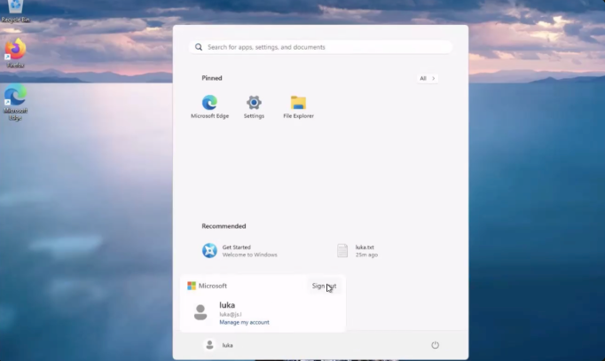

4. 等待 Windows 显示并完成 `Signing out`。这一步会触发 FSLogix 保存并卸载用户 profile container。

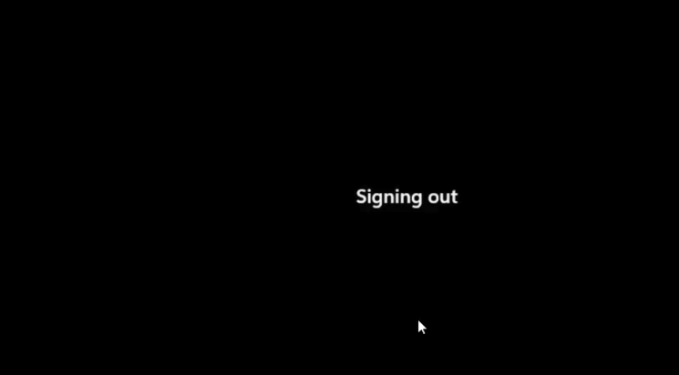

5. 重新登录同一台 VM，或登录下一台使用同一 Golden Image 创建的 VM，确认 `C:\Users\<username>` 下的测试文件仍然存在。

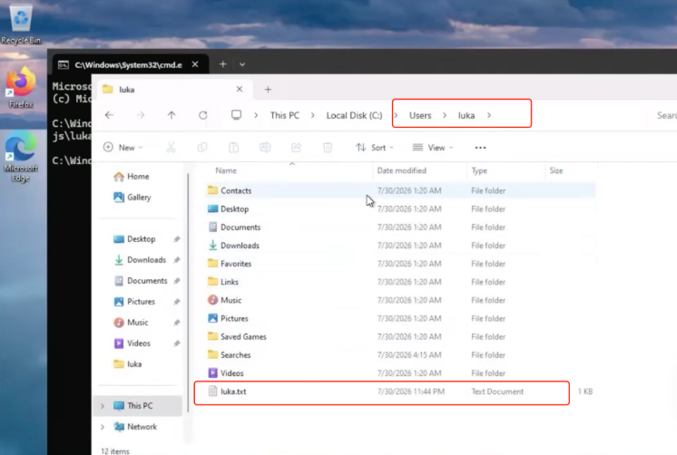

### 5.3 Verify Persistence

Scenario 1 测试流程：

1. 用 AD 用户登录 Windows 11。
2. 在 Desktop 或 Documents 创建测试文件。
3. 正常 `Sign out`，不要直接关机或断开。
4. 重新登录，或销毁并重建 Secure Desktop。
5. 确认测试文件仍然存在。

如果使用 Scenario 1 并要测试“删除第一台 new VM，再创建第二台 new VM”，推荐流程是：

1. 在第一台 VM 中让测试用户正常 `Sign out`。
2. 确认 ZFSSA 上用户 VHDX 仍存在。
3. 删除第一台 VM。
4. 使用同一个 image 创建第二台 VM。
5. 用同一个 AD 用户登录第二台 VM，确认 profile 数据仍然存在。

如果第一台 VM 是直接删除或异常关机，FSLogix 可能来不及卸载 VHDX，ZFSSA 上可能残留 `.lock`、`.meta` 等状态文件。此时第二台 VM 登录同一用户时可能失败。

Scenario 2 测试流程：

1. VM1 使用同一个 AD 用户登录，例如 `JS\jialu`。
2. 在 VM1 上创建测试文件。
3. 不等待 VM1 完成很慢的 `Sign out`，或让 VM1 保持登录。
4. VM2 使用同一个 `JS\jialu` 登录。
5. 确认 VM2 可以进入桌面，不出现 `We can't sign in to your account`。
6. 检查 ZFSSA profile 目录中是否出现多连接模式相关的 RW / RO 差异盘文件。

### 5.4 Check Logs

FSLogix 日志路径：

```text
C:\ProgramData\FSLogix\Logs\Profile
```

查看最新日志：

```powershell
Get-Content "C:\ProgramData\FSLogix\Logs\Profile\Profile_*.log" -Tail 160
```

重点搜索：

```text
ERROR
WARN
CCDLocations
VHDLocations
ProfileType
Access is denied
The network path was not found
FSLogix Profiles feature is not enabled
```

---


## Common Issues and FAQ

### Q1. Windows Explorer 的 Network 里看不到 ZFSSA，正常吗？

正常。Windows `Network` 依赖网络发现/浏览服务，ZFSSA SMB share 不一定自动显示。

请直接访问 UNC 路径：

```text
\\192.168.0.45\primary
```

或测试：

```powershell
Test-NetConnection 192.168.0.45 -Port 445
net view \\192.168.0.45
```

### Q2. 创建 `profiles` 文件夹提示 `Destination Folder Access Denied` 怎么办？

说明 ZFSSA share 根目录 ACL 不允许当前 AD 用户写入。

到 ZFSSA BUI：

```text
Shares > Projects > default > primary > Access
```

给域管理员或当前管理账号 Full Control，例如：

```text
JS\Domain Admins: Full Control
```

然后重新打开：

```text
\\192.168.0.45\primary
```

创建：

```text
profiles
```

### Q3. CCD Location 这行到底怎么写？

这是 Scenario 1 / Cloud Cache 模式使用的配置。

本环境示例：

```text
type=smb,name="SMB Primary",connectionString=\\192.168.0.45\primary\profiles
```

对应关系：

```text
192.168.0.45 = zfs-data-a IP
primary      = ZFSSA SMB share name
profiles     = Task 3 创建的目录
```

如果采用 Scenario 2，则不要配置 `CCDLocations`，改用：

```text
VHDLocations = \\192.168.0.45\primary\profiles
```

### Q4. Join AD 报 `Authentication failed, or the domain controller could not be contacted` 怎么办？

先看 AD Security Event `4625`。

如果事件中有：

```text
IpAddress: <ZFSSA IP>
SubStatus: 0xc0000064
```

说明 ZFSSA 已经联系到 DC，但用户名不存在或格式不对。

不要用：

```text
opc
js\opc
```

应使用 AD 域账号：

```text
Administrator
```

或：

```text
JS\Administrator
```

### Q5. 登录后出现 `We can't sign in to your account` 怎么办？

这是 Windows 使用了临时 profile，通常说明 FSLogix 没能正常创建/挂载 profile container。

先 `Sign out`，不要继续使用临时 profile。

然后检查日志：

```text
C:\ProgramData\FSLogix\Logs\Profile
```

常见原因：

- `Enabled` 没开启。
- `CCDLocations` 没写入。
- SMB 路径错误。
- `profiles` 权限不足。
- 本地已有损坏或冲突 profile。
- 上一次 VM 直接删除，远端 profile container 残留 `.lock` / `.meta` 状态文件。

### Q6. FSLogix 日志显示 `FSLogix Profiles feature is not enabled` 怎么办？

说明总开关没打开。配置：

```text
Computer Configuration > Administrative Templates > FSLogix > Profile Containers > Enabled = Enabled
```

或注册表：

```powershell
reg add "HKLM\SOFTWARE\FSLogix\Profiles" /v Enabled /t REG_DWORD /d 1 /f
```

重启后重新登录测试。

### Q7. `Profile Type = Normal profile` 代表什么？

`Normal profile` 对应 `ProfileType=0`，表示一个用户一次使用一个主 profile container。

适合 Scenario 1：

```text
VM1 登录 JS\jialu
VM1 正常 Sign out
VM2 再登录 JS\jialu
```

如果目标是“VM1 不想等很久 Sign out，VM2 也要能用同一个 AD 用户登录”，不要使用 `Normal profile` 作为最终方案，应使用 Scenario 2：

```text
VHDLocations + ProfileType=3 + VHDCompactDisk=0 + CleanupInvalidSessions=1
```

### Q8. VM1 不想等很久 Sign out，VM2 也要用同一 AD 用户登录，怎么配置？

使用 Scenario 2。核心是从 Cloud Cache `CCDLocations` 改成普通 `VHDLocations`，并启用 `ProfileType=3` 的 RW/RO fallback 多连接模式。

这解决的是：VM2 不因为 VM1 仍占用主 profile container 就直接失败或进入临时 profile。它不是两个 VM 同时写同一个主 VHDX 的双活写入模式。

Golden Image / Source VM 管理员 PowerShell：

```powershell
reg add "HKLM\SOFTWARE\FSLogix\Apps" /v CleanupInvalidSessions /t REG_DWORD /d 1 /f
reg add "HKLM\SOFTWARE\FSLogix\Apps" /v VHDCompactDisk /t REG_DWORD /d 0 /f

reg add "HKLM\SOFTWARE\FSLogix\Profiles" /v Enabled /t REG_DWORD /d 1 /f
reg add "HKLM\SOFTWARE\FSLogix\Profiles" /v DeleteLocalProfileWhenVHDShouldApply /t REG_DWORD /d 1 /f
reg add "HKLM\SOFTWARE\FSLogix\Profiles" /v ProfileType /t REG_DWORD /d 3 /f
reg add "HKLM\SOFTWARE\FSLogix\Profiles" /v VHDLocations /t REG_SZ /d "\\192.168.0.45\primary\profiles" /f
reg add "HKLM\SOFTWARE\FSLogix\Profiles" /v VolumeType /t REG_SZ /d VHDX /f

reg delete "HKLM\SOFTWARE\FSLogix\Profiles" /v CCDLocations /f
```

如果之前通过 `gpedit.msc` 配置过 `CCD Locations`，需要把该策略改为 `Not Configured`，否则 `HKLM\SOFTWARE\Policies\FSLogix\Profiles` 可能覆盖上述设置。

验证：

```powershell
reg query HKLM\SOFTWARE\FSLogix\Apps /v VHDCompactDisk
reg query HKLM\SOFTWARE\FSLogix\Profiles /v VHDLocations
reg query HKLM\SOFTWARE\FSLogix\Profiles /v ProfileType
reg query HKLM\SOFTWARE\FSLogix\Profiles /v CCDLocations
```

期望：

```text
VHDCompactDisk = 0
VHDLocations   = \\192.168.0.45\primary\profiles
ProfileType    = 3
CCDLocations   不存在
```

如果 `reg query HKLM\SOFTWARE\Policies\FSLogix\Profiles /v CCDLocations` 还能查到值，说明本地组策略仍在覆盖配置，需要先把 Cloud Cache `CCD Locations` 改为 `Not Configured`。

### Q9. 不想每次手动清理 `.lock`，应该怎么做？

优先使用 Scenario 2，减少 Cloud Cache 状态文件和 sign out 等待：

```text
VHDLocations + ProfileType=3 + VHDCompactDisk=0 + CleanupInvalidSessions=1
```

其中：

- `VHDLocations`：单 ZFSSA SMB share 场景更简单。
- `ProfileType=3`：主 RW profile 被占用时，允许第二个会话 fallback 到 RO / 差异盘方式进入。
- `VHDCompactDisk=0`：减少注销时 VHD compact 带来的等待。
- `CleanupInvalidSessions=1`：降低异常中断后残留无效 session 的概率。

如果某一次已经因为异常删除 VM 留下损坏或不可恢复的旧 profile 状态，仍可能需要人工兜底处理。安全做法是先确认没有 VM 正在使用该用户，然后把整个用户 profile 目录改名备份，让 FSLogix 重新创建：

```cmd
ren "\\192.168.0.45\primary\profiles\Profile_jialu" "Profile_jialu.bak-20260730"
```

不要直接删除 `.vhd`，除非确认用户数据不要了。

## Quick Validation Checklist

部署完成后按以下顺序验证。

通用检查：

- ZFSSA DNS 指向 `10.100.0.163`，能解析 `js.l` SRV 记录。
- ZFSSA 已成功 Join AD。
- Windows 管理机能打开 `\\192.168.0.45\primary`。
- 已创建 `\\192.168.0.45\primary\profiles`。
- `profiles` ACL 包含 `Domain Users`、`Domain Admins`、`CREATOR OWNER`。
- Windows 11 已安装 FSLogix。
- `HKLM\SOFTWARE\FSLogix\Apps\CleanupInvalidSessions = 1`。
- `HKLM\SOFTWARE\FSLogix\Profiles\Enabled = 1`。
- AD 用户登录后，ZFSSA share 下生成用户 VHDX。
- 注销并重新登录后，用户文件和设置保持不丢失。

Scenario 1 — blog default / Cloud Cache：

- `CCDLocations = type=smb,name="SMB Primary",connectionString=\\192.168.0.45\primary\profiles`。
- `ProfileType = 0`，或策略中显示 `Normal profile`。
- `VHDLocations` 不存在。
- 切换到另一台 VM 前，测试用户需要先在上一台 VM 正常 `Sign out`。

Scenario 2 — 当前目标推荐 / 单 ZFSSA SMB：

- `VHDLocations = \\192.168.0.45\primary\profiles`。
- `ProfileType = 3`。
- `VHDCompactDisk = 0`。
- `CCDLocations` 不存在；`HKLM\SOFTWARE\Policies\FSLogix\Profiles` 中也不应有旧的 `CCDLocations` 策略覆盖项。
- VM1 仍在线或还没完成注销时，VM2 用同一 AD 用户登录不应进入临时 profile。

---

## VHDLocations vs CCDLocations

`VHDLocations` 和 `CCDLocations` 都是告诉 FSLogix profile container 存放在哪里，但它们不是同一种模式。当前环境只有一个 ZFSSA SMB share，因此如果目标是“VM1 不想等很久 Sign out，VM2 也能用同一 AD 用户登录”，优先使用 `VHDLocations`。

### VHDLocations

`VHDLocations` 是普通 Profile Container 路径。Windows 11 VM 登录时，FSLogix 直接通过 SMB 访问 ZFSSA 上的 VHDX。

示例：

```powershell
reg add "HKLM\SOFTWARE\FSLogix\Profiles" /v VHDLocations /t REG_SZ /d "\\192.168.0.45\primary\profiles" /f
```

访问模型：

```text
Windows 11 VM -> SMB TCP/445 -> \\192.168.0.45\primary\profiles -> Profile_<username>.vhdx
```

适合：

- 单个 ZFSSA SMB share。
- 希望配置简单、状态文件更少。
- 希望减少 Cloud Cache 带来的 sign out / merge 等待。
- 当前目标：VM1 不想等很久 Sign out，VM2 也要能用同一个 AD 用户登录。

注意：如果要支持同一个 AD 用户同时或连续登录多台 VM，需要配合 `ProfileType=3`，让第二个会话在主 RW profile 被占用时可以 fallback 到 RO / 差异盘方式进入。

### CCDLocations

`CCDLocations` 是 Cloud Cache 配置。Windows 11 VM 会使用 Cloud Cache provider 字符串，并维护 Cloud Cache 相关本地缓存和远端 provider 状态。

示例：

```powershell
reg add "HKLM\SOFTWARE\FSLogix\Profiles" /v CCDLocations /t REG_SZ /d 'type=smb,name="SMB Primary",connectionString=\\192.168.0.45\primary\profiles' /f
```

访问模型：

```text
Windows 11 VM -> FSLogix Cloud Cache -> SMB provider -> \\192.168.0.45\primary\profiles
```

适合：

- 需要 Cloud Cache 语义。
- 后续可能配置多个 storage provider。
- 可以接受 sign out 时 Cloud Cache flush / merge 的额外等待。
- 同一个 AD 用户一次只登录一台 VM，切换 VM 前能正常 `Sign out`。

注意：`CCDLocations` 的 value 不是普通 UNC 路径，而是 provider 字符串。当前 blog 示例虽然只写了一个 SMB provider，但它仍然会按 Cloud Cache 模式工作。

### Comparison

| 项目 | `VHDLocations` | `CCDLocations` |
| --- | --- | --- |
| FSLogix 模式 | 普通 Profile Container | Cloud Cache |
| 配置格式 | UNC 路径 | provider 字符串 |
| 示例 | `\\192.168.0.45\primary\profiles` | `type=smb,name="SMB Primary",connectionString=\\192.168.0.45\primary\profiles` |
| 当前环境适配 | 单个 ZFSSA SMB share 更合适 | blog 默认方案，可保留但不是当前目标优先方案 |
| 多存储 provider | 不适合 | 适合扩展多个 provider |
| 本地缓存 / 远端状态 | 相对简单 | Cloud Cache 状态更多 |
| 常见额外状态文件 | 较少 | 可能有 `.lock`、`.meta` 等 |
| Sign out 体验 | 配合 `VHDCompactDisk=0` 通常更快 | 可能等待 cache flush / merge / compact |
| 异常删除 VM 后恢复 | 相对简单，配合 `CleanupInvalidSessions=1` | 可能残留更复杂的 Cloud Cache 状态 |
| 同一 AD 用户多 VM 登录 | 配合 `ProfileType=3` 使用 | 不建议作为当前目标优先方案 |
| 推荐结论 | Scenario 2 | Scenario 1 / blog default |

一句话总结：

```text
VHDLocations = 直接使用 ZFSSA SMB 上的 profile VHDX，适合单 ZFS share 和当前多 VM 登录目标。
CCDLocations = Cloud Cache，适合需要 Cloud Cache / 多 provider 的场景，但 sign out 和异常恢复更复杂。
```

不要同时配置两者。如果之前已经通过 `gpedit.msc` 配置了 Cloud Cache `CCD Locations`，切换到 `VHDLocations` 前需要把该策略改为 `Not Configured`，并确认 `HKLM\SOFTWARE\Policies\FSLogix\Profiles` 中没有旧的 `CCDLocations` 覆盖项。

---
