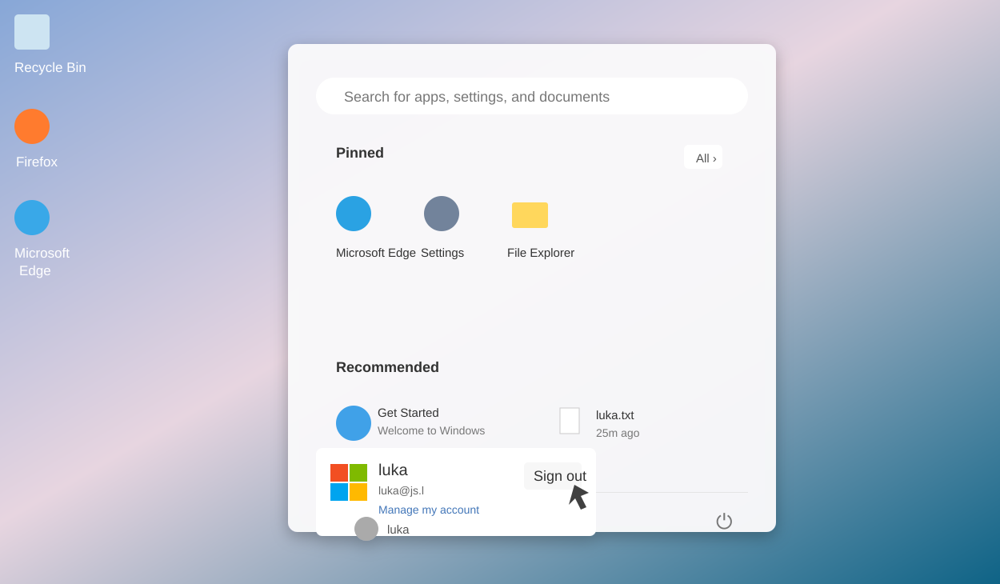
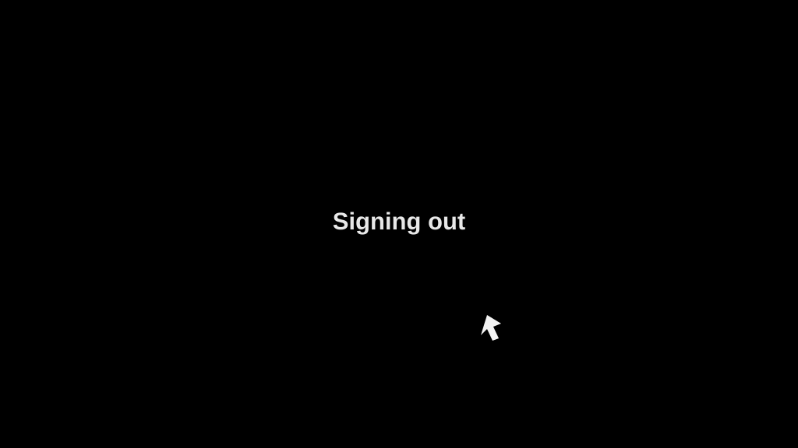
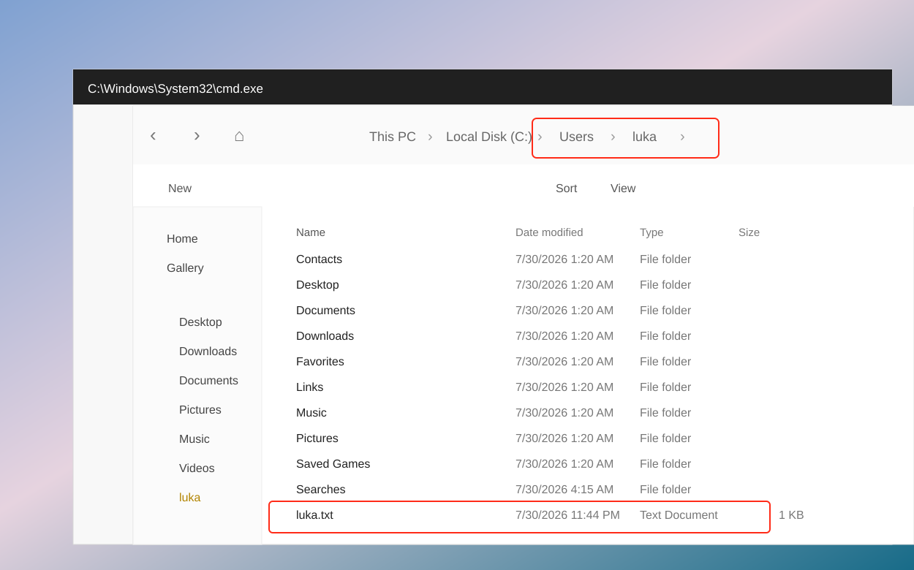

# Configure Microsoft FSLogix Profile Containers with OCI Secure Desktops using ZFS SMB

This document describes how to use an **Oracle ZFS Storage Appliance (ZFSSA) SMB share** on OCI to host **Microsoft FSLogix Profile Containers**, and how to use that share with an **OCI Secure Desktops / Windows 11 Golden Image**.

The document is based on an actual configuration workflow. Replace the sample IP addresses, domain names, and share names with values from your own environment.

| Item | Example Value | Description |
| --- | --- | --- |
| AD / DNS / DC | `10.100.0.163` | Active Directory domain controller, also used as AD DNS |
| AD DNS Domain | `js.l` | AD domain name used when joining the domain |
| ZFSSA Data IP | `192.168.0.45` | `zfs-data-a` VNIC IP, used for SMB / FSLogix data access |
| ZFSSA Admin IP | Public management IP, for example | `zfs-adm-a` VNIC IP, used for BUI / SSH management, not for FSLogix |
| SMB Share | `primary` | ZFSSA filesystem / SMB share name |
| FSLogix Profile Path | `\\192.168.0.45\primary\profiles` | The path used by the FSLogix configuration |
| Test AD Users | `js\luka`, `js\dennis` | AD test users used in this validation |

> Important: the FSLogix path must use the **ZFSSA data VNIC IP**. Do not use the AD IP address, and do not use the ZFSSA public management IP.

- **ZFS (Zettabyte File System)** provides the backend storage layer, 
- **SMB (Server Message Block)** provides Windows file share access, 
- **Microsoft FSLogix** Profile Containers store Windows user profiles as VHDX files on that SMB share.

---

## Architecture Overview

The overall architecture is shown below:


Key traffic flows:

- Windows 11 / Secure Desktop accesses AD / DNS / DC `10.100.0.163` for user authentication, DNS queries, and domain services.
- Windows 11 / Secure Desktop accesses the ZFSSA data IP `192.168.0.45` over SMB `TCP/445` to mount the FSLogix profile container.
- ZFSSA itself must access AD / DNS / DC for DNS SRV lookup, Kerberos / LDAP, and domain join operations.
- The ZFSSA admin IP is only for BUI / SSH management. It should not be used as the FSLogix SMB data path.

```text
AD / DNS / DC
10.100.0.163
Responsible for: users, groups, authentication, DNS SRV records, Kerberos / NTLM

ZFSSA
zfs-data-a: 192.168.0.45
Responsible for: SMB share, profiles directory, FSLogix VHDX files

Windows 11 Golden Image / Secure Desktop
Responsible for: installing FSLogix, reading policy, mounting the profile container at logon
```

After a user logs in to Windows 11, the visible profile path is still:

```text
C:\Users\<username>
```

However, the real profile data is stored in:

```text
\\192.168.0.45\primary\profiles\<user-folder>\Profile_<username>.vhdx
```

Active Directory does not store these directories or VHDX files. AD is only responsible for authentication and authorization.

---

## Task 1 — Create ZFSSA Instance from OCI Marketplace

Launch the **ZFS Storage Appliance / ZFSSA Storage Deployment** Resource Manager stack from OCI Marketplace.

This test uses the **SingleHead single-node model**, which means a non-HA deployment. The following images show sample Resource Manager Stack variables to configure; replace the compartment, VCN, subnet, AD, and SSH key values with your own environment values.


A basic PoC deployment can be understood as:

```text
1 ZFSSA VM / appliance instance
+
2 OCI Block Volumes used to create a mirrored storage pool
```

Notes:

- The boot volume is the system disk and is not counted as one of the two data disks.
- The two block volumes are later used in the ZFSSA BUI to create the storage pool.
- For production, HA can be considered, but HA introduces primary / secondary heads and is no longer the same as a simple single-node model.

### Network Recommendation

For production, place ZFSSA in a private subnet and access the management interface through Bastion, VPN, FastConnect, or a Windows management host.

For a PoC, a public subnet can be used, but restrict security rules:

- Allow management ports such as BUI / SSH only from trusted public IP addresses.
- Do not expose SMB `TCP/445` to the public Internet.
- FSLogix / SMB clients should access the private IP of `zfs-data-a`.

Common ZFSSA VNIC usage:

| VNIC | Usage |
| --- | --- |
| `zfs-0-a` | Primary VNIC, underlying/system use; not recommended as the SMB path |
| `zfs-adm-a` | Admin access for BUI / SSH management |
| `zfs-data-a` | Data access for SMB / NFS / NAS traffic |
| `zfs-ax-a` | Auxiliary or HA-related usage |

The FSLogix path should use:

```text
\\<zfs-data-a-private-ip>\<share-name>\profiles
```

Example:

```text
\\192.168.0.45\primary\profiles
```

---

## Task 2 — Configure ZFSSA

### 2.1 Login to ZFSSA BUI

After deployment, first SSH to the ZFSSA appliance with your private key, for example:

```bash
ssh -i <private-key> opc@<zfs-adm-a-ip-or-fqdn>
```

Then set the BUI login password for `opc` in the ZFSSA CLI:

```text
configuration users
select opc
set initial_password
commit
```

Open the BUI:

```text
https://<zfs-adm-a-ip-or-fqdn>:215/
```

Log in with `opc` and the password you just set.


### 2.2 Configure DNS

Go to:

```text
Configuration > Services > DNS
```

DNS must point to AD DNS, not the default OCI DNS.

Example:

```text
DNS Domain: js.l
DNS Search Domain(s): js.l
DNS Servers: 10.100.0.163
```


If ZFSSA still uses `169.254.169.254`, it usually cannot query the AD SRV records, and the domain join may fail with:

```text
The appliance could not find the appropriate SRV record ...
```

You can verify SRV records on the AD server:

```powershell
nslookup -type=SRV _ldap._tcp.dc._msdcs.js.l 10.100.0.163
nslookup -type=SRV _kerberos._tcp.js.l 10.100.0.163
nslookup adfs.js.l 10.100.0.163
```

### 2.3 Configure NTP

Kerberos is time-sensitive. Keep the time difference between ZFSSA and the DC below 5 minutes.

Go to:

```text
Configuration > Services > NTP
```

Use the AD / DC or the same time source used by the DC:

```text
NTP Server: 10.100.0.163
```

### 2.4 Join Active Directory Domain

Go to:

```text
Configuration > Services > Active Directory
```

Click `JOIN DOMAIN` and enter the AD domain information.

Prefer a short username or NetBIOS format first, for example:

```text
Domain: js.l
User: Administrator
Password: <AD Administrator password>
```

Or:

```text
Domain: js.l
User: JS\Administrator
Password: <AD Administrator password>
```

Replace `JS` with your real NetBIOS domain name. You can query it on the DC:

```powershell
(Get-ADDomain).NetBIOSName
```

Do not use a local ZFSSA user, for example:

```text
opc
js\opc
```

`opc` is a local ZFSSA management account, not an AD domain account.


If domain join fails, check DC Security Event `4625`:

- `SubStatus 0xc0000064`: the user does not exist; this is usually a username format issue.
- `SubStatus 0xc000006A`: incorrect password.
- If `IpAddress` is the ZFSSA IP, the network and DNS path already works; the issue is authentication or account format.

### 2.5 Verify Storage Pool

Go to:

```text
Configuration > Storage
```

Confirm that the block volumes have been used to create the ZFSSA storage pool.


### 2.6 Create Project and SMB Filesystem

Go to:

```text
Shares > Projects
```

Create a project, then create a filesystem / share. In this example, the filesystem / share name is:

```text
primary
```


Confirm that the mountpoint is similar to:

```text
/export/primary
```

The corresponding SMB UNC path is usually:

```text
\\192.168.0.45\primary
```

### 2.7 Configure SMB Protocol and Root Access

Go to:

```text
Shares > Projects > <project> > <filesystem> > Protocols
```

Confirm that SMB is enabled and that the SMB share name matches the UNC path used later, for example `primary`.

Go to:

```text
Shares > Projects > <project> > <filesystem> > Access
```

Configure the Root Directory ACL.


For a PoC, if an AD administrator cannot create `profiles` under `\\192.168.0.45\primary`, temporarily grant Full Control to the domain administrator or test user. Do not keep `everyone@ Full Control` long-term in production.

Recommended examples:

```text
JS\Domain Admins: Full Control
JS\Administrator: Full Control
```

Root directory permissions only need to allow administrators to create and manage the `profiles` folder. The actual permissions for FSLogix users are configured in Task 3.

---

## Task 3 — Configure NTFS Permissions for ZFSSA SMB Share

The goal of Task 3 is to create the `profiles` directory on the ZFSSA SMB share and configure Windows / NTFS-style ACLs.

This step can be performed on the AD server, or on any Windows management machine that has joined the same AD domain and can access the ZFSSA SMB share.

### 3.1 Open the SMB Share Directly

Do not rely on Windows Explorer `Network` discovery. Enter the UNC path directly in the address bar or through `Win + R`:

```text
\\192.168.0.45\primary
```

If it cannot be opened, test the SMB port first:

```powershell
Test-NetConnection 192.168.0.45 -Port 445
net view \\192.168.0.45
```

If the share opens, create the following folder in the share root:

```text
profiles
```

The final path is:

```text
\\192.168.0.45\primary\profiles
```


If creating `profiles` fails with `Destination Folder Access Denied`, the share root ACL does not allow the current AD user to write. Go back to Task 2.7 and grant Full Control to the domain administrator in the ZFSSA BUI `Access` page, then open the UNC path again.

### 3.2 Configure Profiles Folder ACL

Right-click the `profiles` folder:

```text
Properties > Security > Advanced
```

Add the following principals:

| Principal | Permission | Applies to | Purpose |
| --- | --- | --- | --- |
| `JS\Domain Users` | Modify / Create folders | This folder | Allows users to create their own profile container directory |
| `CREATOR OWNER` | Modify | Subfolders and files only | Lets users own the directories and VHDX files they create |
| `JS\Domain Admins` | Full Control | This folder, subfolders and files | Administration and troubleshooting |

Add Domain Users:


Add Domain Admins:


Add CREATOR OWNER:


### 3.3 Disable Inheritance and Remove Unneeded Entries

In `Advanced Security Settings`:

1. Click `Disable inheritance`.
2. Select `Convert inherited permissions into explicit permissions on this object`.
3. Remove unnecessary entries.
4. Keep only the required entries, such as `CREATOR OWNER`, `Domain Admins`, and `Domain Users`.

The final result should look similar to:


### 3.4 Optional: Configure with icacls

You can also configure the permissions from an elevated PowerShell session. Replace `JS` with your actual NetBIOS domain name:

```powershell
icacls \\192.168.0.45\primary\profiles /inheritance:r
icacls \\192.168.0.45\primary\profiles /grant "CREATOR OWNER:(OI)(CI)(IO)(M)"
icacls \\192.168.0.45\primary\profiles /grant "JS\Domain Admins:(OI)(CI)(F)"
icacls \\192.168.0.45\primary\profiles /grant "JS\Domain Users:(M)"
```

During PoC troubleshooting, if you still suspect a permission issue, temporarily grant broader permissions to Domain Users:

```powershell
icacls \\192.168.0.45\primary\profiles /grant "JS\Domain Users:(OI)(CI)(M)"
```

Tighten the permissions again after validation.

---

## Task 4 — Deploy and Configure FSLogix in Windows 11 Golden Image

Task 4 is performed on the Windows 11 Golden Image / Secure Desktop template VM, not on the AD server.

### 4.1 Install FSLogix

Download the FSLogix installer package, extract it, and go to:

```text
x64\Release
```

Run:

```text
FSLogixAppsSetup.exe
```

Reboot after installation.


### 4.2 Copy ADMX / ADML Policy Templates

Copy the policy template files:

```text
fslogix.admx -> C:\Windows\PolicyDefinitions\fslogix.admx
fslogix.adml -> C:\Windows\PolicyDefinitions\en-US\fslogix.adml
```

### 4.3 Configure FSLogix Profiles — Choose One Scenario

Run:

```text
gpedit.msc
```

Go to:

```text
Computer Configuration > Administrative Templates > FSLogix > Profile Containers
```


The following baseline settings are recommended for all scenarios:

| Setting | Value | Description |
| --- | --- | --- |
| `Enabled` | `Enabled` | Enables FSLogix Profile Container |
| `Delete Local Profile When VHD Should Apply` | `Enabled` | Avoids conflicts between local profile and FSLogix profile |
| `Roam Identity` | `Enabled` | Roams identity-related data |
| `Size in MBs` | `30000` | Example size; adjust as required |
| `Locked Retry Count` | `3` or higher | Retry count when the container is locked |
| `Locked Retry Interval` | `15` | Retry interval in seconds |
| `Reattach Count` | `3` or higher | Retry count for reattaching the VHDX |
| `Reattach Interval` | `15` | Reattach interval in seconds |


> If `Enabled` is not configured, the FSLogix log may show `FSLogix Profiles feature is not enabled`, and users may log in with a temporary profile.

It is also recommended to enable invalid session cleanup to reduce the chance of profile locks after abnormal shutdowns, direct VM deletion, or interrupted sessions:

```powershell
reg add "HKLM\SOFTWARE\FSLogix\Apps" /v CleanupInvalidSessions /t REG_DWORD /d 1 /f
```

This does not replace a normal sign-out and does not guarantee automatic recovery for every abnormal case. It only reduces the chance that a previous session failed to unload the VHDX and blocks the next logon.

Choose **one** of the following two scenarios. Select the scenario based on your goal, then bake the corresponding configuration into the Golden Image. Do not configure both `CCDLocations` and `VHDLocations` on the same Golden Image.

### 4.4 Scenario 1 — Blog Default: Cloud Cache + Normal Profile

This configuration matches the original Oracle blog approach. Use it when:

- You want to keep the blog-style Cloud Cache `CCDLocations` configuration.
- You may expand to multiple Cloud Cache providers later.
- The same AD user logs in to only one Windows 11 VM at a time.
- Before switching to another VM, the user can normally `Sign out` from the previous VM.

Configure the following:

| Setting | Value |
| --- | --- |
| `Profile Type` | `Normal profile` |
| `CCD Locations` | `type=smb,name="SMB Primary",connectionString=\\192.168.0.45\primary\profiles` |
| `Clear Cache on Logoff` | `Enabled` |
| `Healthy Providers Required for Register` | `Enabled`, value `1` |

`Profile Type = Normal profile` means one user uses one primary profile container at a time. If the same user is still logged in to VM1, logging in to VM2 with the same user may fail because the container is locked.

Configure Cloud Cache here:

```text
Computer Configuration > Administrative Templates > FSLogix > Profile Containers > Cloud Cache
```

Enable `CCD Locations` and enter the full value as a single line:

```text
type=smb,name="SMB Primary",connectionString=\\192.168.0.45\primary\profiles
```

Meaning:

- `type=smb`: use the SMB provider.
- `name="SMB Primary"`: display name of this provider.
- `connectionString=\\192.168.0.45\primary\profiles`: the profiles path created and authorized in Task 3.

Do not use the AD IP in CCD Location:

```text
Wrong: \\10.100.0.163\...
```

Do not use the ZFSSA public management IP:

```text
Not recommended: \\<zfs-adm-public-ip>\primary\profiles
```

Use the ZFSSA data IP or a stable DNS name:

```text
\\192.168.0.45\primary\profiles
```

Or:

```text
\\zfs-a.js.l\primary\profiles
```

If the local group policy does not write the settings successfully, configure them directly from an elevated PowerShell session:

```powershell
reg add "HKLM\SOFTWARE\FSLogix\Apps" /v CleanupInvalidSessions /t REG_DWORD /d 1 /f
reg add "HKLM\SOFTWARE\FSLogix\Profiles" /v Enabled /t REG_DWORD /d 1 /f
reg add "HKLM\SOFTWARE\FSLogix\Profiles" /v CCDLocations /t REG_SZ /d 'type=smb,name="SMB Primary",connectionString=\\192.168.0.45\primary\profiles' /f
reg add "HKLM\SOFTWARE\FSLogix\Profiles" /v DeleteLocalProfileWhenVHDShouldApply /t REG_DWORD /d 1 /f
reg add "HKLM\SOFTWARE\FSLogix\Profiles" /v SizeInMBs /t REG_DWORD /d 30000 /f
reg add "HKLM\SOFTWARE\FSLogix\Profiles" /v ProfileType /t REG_DWORD /d 0 /f
reg delete "HKLM\SOFTWARE\FSLogix\Profiles" /v VHDLocations /f
reg delete "HKLM\SOFTWARE\FSLogix\Profiles" /v VolumeType /f
gpupdate /force
```

After rebooting Windows 11, validate:

```powershell
reg query HKLM\SOFTWARE\FSLogix\Apps /v CleanupInvalidSessions
reg query HKLM\SOFTWARE\FSLogix\Profiles /v Enabled
reg query HKLM\SOFTWARE\FSLogix\Profiles /v CCDLocations
reg query HKLM\SOFTWARE\FSLogix\Profiles /v ProfileType
```

Expected result:

```text
CleanupInvalidSessions    REG_DWORD    0x1
Enabled                   REG_DWORD    0x1
CCDLocations              REG_SZ       type=smb,name="SMB Primary",connectionString=\\192.168.0.45\primary\profiles
ProfileType               REG_DWORD    0x0
```

### 4.5 Scenario 2 — Recommended for Same AD User on Multiple VMs

This is the recommended configuration for the current target:

```text
Goal 1: VM1 should not have a very slow sign-out caused by Cloud Cache flush / compact.
Goal 2: VM2 should be able to log in with the same AD user even if VM1 has not fully exited or is still online.
```

Use this scenario when:

- There is only one ZFSSA SMB share: `\\192.168.0.45\primary\profiles`.
- You do not need Cloud Cache multi-provider capability.
- You want to reduce Cloud Cache `.lock` / `.meta` state complexity.
- You want VM2 to avoid falling directly into a temporary profile only because VM1 is holding the primary profile container.

This scenario changes from Cloud Cache to a regular Profile Container and enables multi-connection RW/RO fallback:

```text
VHDLocations + ProfileType=3 + VHDCompactDisk=0 + CleanupInvalidSessions=1
```

Key settings:

| Setting | Value | Purpose |
| --- | --- | --- |
| `VHDLocations` | `\\192.168.0.45\primary\profiles` | Uses the single ZFSSA SMB path directly instead of a Cloud Cache provider string |
| `ProfileType` | `3` | Tries RW profile first; if RW is already in use, falls back to RO / differencing disk mode |
| `VHDCompactDisk` | `0` | Disables automatic VHD compaction at sign-out to reduce waiting time |
| `CleanupInvalidSessions` | `1` | Cleans invalid FSLogix sessions after abnormal interruption |
| `CCDLocations` | Not configured | Avoids Cloud Cache state and conflicts with `VHDLocations` |

Elevated PowerShell:

```powershell
reg add "HKLM\SOFTWARE\FSLogix\Apps" /v CleanupInvalidSessions /t REG_DWORD /d 1 /f
reg add "HKLM\SOFTWARE\FSLogix\Apps" /v VHDCompactDisk /t REG_DWORD /d 0 /f

reg add "HKLM\SOFTWARE\FSLogix\Profiles" /v Enabled /t REG_DWORD /d 1 /f
reg add "HKLM\SOFTWARE\FSLogix\Profiles" /v DeleteLocalProfileWhenVHDShouldApply /t REG_DWORD /d 1 /f
reg add "HKLM\SOFTWARE\FSLogix\Profiles" /v SizeInMBs /t REG_DWORD /d 30000 /f
reg add "HKLM\SOFTWARE\FSLogix\Profiles" /v ProfileType /t REG_DWORD /d 3 /f
reg add "HKLM\SOFTWARE\FSLogix\Profiles" /v VHDLocations /t REG_SZ /d "\\192.168.0.45\primary\profiles" /f
reg add "HKLM\SOFTWARE\FSLogix\Profiles" /v VolumeType /t REG_SZ /d VHDX /f

reg delete "HKLM\SOFTWARE\FSLogix\Profiles" /v CCDLocations /f
```

If `CCD Locations` was previously configured through `gpedit.msc`, set the Cloud Cache `CCD Locations` policy to `Not Configured`. Otherwise, values under `HKLM\SOFTWARE\Policies\FSLogix\Profiles` may override the regular registry configuration.

Check whether policy values still exist:

```powershell
reg query "HKLM\SOFTWARE\Policies\FSLogix\Profiles" /v CCDLocations
reg query "HKLM\SOFTWARE\Policies\FSLogix\Profiles" /v VHDLocations
reg query "HKLM\SOFTWARE\Policies\FSLogix\Profiles" /v ProfileType
```

If you confirm that local registry values are used instead of policy, you can temporarily remove old policy values:

```powershell
reg delete "HKLM\SOFTWARE\Policies\FSLogix\Profiles" /v CCDLocations /f
reg delete "HKLM\SOFTWARE\Policies\FSLogix\Profiles" /v VHDLocations /f
reg delete "HKLM\SOFTWARE\Policies\FSLogix\Profiles" /v ProfileType /f
gpupdate /force
```

After rebooting Windows 11, validate:

```powershell
reg query HKLM\SOFTWARE\FSLogix\Apps /v CleanupInvalidSessions
reg query HKLM\SOFTWARE\FSLogix\Apps /v VHDCompactDisk
reg query HKLM\SOFTWARE\FSLogix\Profiles /v Enabled
reg query HKLM\SOFTWARE\FSLogix\Profiles /v VHDLocations
reg query HKLM\SOFTWARE\FSLogix\Profiles /v ProfileType
reg query HKLM\SOFTWARE\FSLogix\Profiles /v CCDLocations
```

Expected result:

```text
CleanupInvalidSessions    REG_DWORD    0x1
VHDCompactDisk            REG_DWORD    0x0
Enabled                   REG_DWORD    0x1
VHDLocations              REG_SZ       \\192.168.0.45\primary\profiles
ProfileType               REG_DWORD    0x3
CCDLocations              Not present
```

Test flow:

1. Log in to VM1 as `JS\jialu`.
2. Do not wait for a very slow `Sign out` on VM1, or keep VM1 logged in.
3. Log in to VM2 with the same `JS\jialu` account.
4. VM2 should enter the desktop and should not fail only because the primary profile container is locked.

Limitations:

- This is an RW/RO fallback multi-connection mode, not an active-active model where two VMs write to the same primary VHDX at the same time.
- Normally only one VM holds the RW profile at a time; the other VM enters with RO / differencing disk behavior.
- Being able to log in to the second VM does not mean all user changes are instantly visible between both VMs.
- User changes across multiple VMs are handled during sign-out and merge phases, and some waiting time may still exist.
- All participating Windows 11 VMs must use the same FSLogix configuration.
- If OneDrive is used, do not use the same profile container from multiple VMs at the same time.

---

## Task 5 — Create Custom Image and Test FSLogix

### 5.1 Create Golden Image

After installing FSLogix and configuring the policies on the Windows 11 template VM, create an OCI Secure Desktops custom image.

Use this custom image to create a new Secure Desktop Pool.

### 5.2 Login Test

Log in to the Windows 11 desktop with an AD user.

If login succeeds, the user still sees:

```text
C:\Users\<username>
```

However, an FSLogix container should be created on the ZFSSA share, for example:

```text
\\192.168.0.45\primary\profiles\<username>_<SID>\Profile_<username>.vhdx
```

The exact directory naming depends on FSLogix configuration. It may be `username_SID` or `SID_username`.

By default, the FSLogix directory on ZFSSA is generated by user and SID, not by VM hostname. Therefore, when the same AD user logs in from different Windows 11 VMs, FSLogix tries to use the same remote profile container.

#### Sign-out Validation Step (Very Important)

> Sign out of the Windows 11 desktop (very important step)  
> Note: Signing out of Windows 11 is crucial for FSLogix to function correctly, as it ensures that the user profile data is properly saved to the FSLogix profile container located on the ZFSSA.

Use the following sequence during testing:

1. Log in to Windows 11 with a test domain user, for example `js\luka` or `js\dennis`.
2. Create or modify a test file in the user profile, for example `C:\Users\luka\luka.txt`.
3. From the Windows 11 Start menu, select the current user and click `Sign out`. Do not only close the RDP / Secure Desktop window.



4. Wait until Windows shows and completes `Signing out`. This step triggers FSLogix to save and unload the user profile container.



5. Log in again to the same VM, or log in to another VM created from the same Golden Image, and confirm that the test file still exists under `C:\Users\<username>`.



### 5.3 Verify Persistence

Scenario 1 test flow:

1. Log in to Windows 11 as an AD user.
2. Create a test file on Desktop or Documents.
3. Perform a normal `Sign out`; do not directly power off or disconnect.
4. Log in again, or destroy and recreate the Secure Desktop.
5. Confirm that the test file still exists.

If you use Scenario 1 and want to test “delete the first new VM, then create a second new VM”, use this recommended flow:

1. Let the test user normally `Sign out` from the first VM.
2. Confirm that the user VHDX still exists on ZFSSA.
3. Delete the first VM.
4. Create the second VM from the same image.
5. Log in to the second VM with the same AD user and confirm that the profile data still exists.

If the first VM is deleted directly or shut down abnormally, FSLogix may not have time to unload the VHDX, and `.lock`, `.meta`, or other state files may remain on ZFSSA. In that case, logging in to the second VM with the same user may fail.

Scenario 2 test flow:

1. Log in to VM1 with the same AD user, for example `JS\jialu`.
2. Create a test file on VM1.
3. Do not wait for a very slow `Sign out` on VM1, or keep VM1 logged in.
4. Log in to VM2 with the same `JS\jialu` account.
5. Confirm that VM2 can enter the desktop and does not show `We can't sign in to your account`.
6. Check whether RW / RO differencing disk files related to multi-connection mode appear in the ZFSSA profile directory.

### 5.4 Check Logs

FSLogix log path:

```text
C:\ProgramData\FSLogix\Logs\Profile
```

View the latest log:

```powershell
Get-Content "C:\ProgramData\FSLogix\Logs\Profile\Profile_*.log" -Tail 160
```

Search for:

```text
ERROR
WARN
CCDLocations
VHDLocations
ProfileType
Access is denied
The network path was not found
FSLogix Profiles feature is not enabled
```

---


## Common Issues and FAQ

### Q1. Is it normal that ZFSSA does not appear under Windows Explorer Network?

Yes. Windows `Network` relies on network discovery / browse services, and a ZFSSA SMB share may not appear automatically.

Access the UNC path directly:

```text
\\192.168.0.45\primary
```

Or test:

```powershell
Test-NetConnection 192.168.0.45 -Port 445
net view \\192.168.0.45
```

### Q2. What should I do if creating the `profiles` folder shows `Destination Folder Access Denied`?

The ZFSSA share root ACL does not allow the current AD user to write.

Go to the ZFSSA BUI:

```text
Shares > Projects > default > primary > Access
```

Grant Full Control to the domain administrator or current management account, for example:

```text
JS\Domain Admins: Full Control
```

Then reopen:

```text
\\192.168.0.45\primary
```

Create:

```text
profiles
```

### Q3. What exactly should the CCD Location line look like?

This is used only for Scenario 1 / Cloud Cache mode.

Example for this environment:

```text
type=smb,name="SMB Primary",connectionString=\\192.168.0.45\primary\profiles
```

Mapping:

```text
192.168.0.45 = zfs-data-a IP
primary      = ZFSSA SMB share name
profiles     = directory created in Task 3
```

If you use Scenario 2, do not configure `CCDLocations`. Use:

```text
VHDLocations = \\192.168.0.45\primary\profiles
```

### Q4. What should I do if joining AD reports `Authentication failed, or the domain controller could not be contacted`?

First check AD Security Event `4625`.

If the event contains:

```text
IpAddress: <ZFSSA IP>
SubStatus: 0xc0000064
```

ZFSSA has already contacted the DC, but the user does not exist or the username format is wrong.

Do not use:

```text
opc
js\opc
```

Use an AD domain account:

```text
Administrator
```

Or:

```text
JS\Administrator
```

### Q5. What should I do if Windows shows `We can't sign in to your account` after login?

Windows is using a temporary profile. This usually means FSLogix failed to create or mount the profile container.

First `Sign out`. Do not continue using the temporary profile.

Then check logs:

```text
C:\ProgramData\FSLogix\Logs\Profile
```

Common causes:

- `Enabled` is not configured.
- `CCDLocations` is not configured.
- SMB path is incorrect.
- The `profiles` permissions are insufficient.
- A damaged or conflicting local profile already exists.
- The previous VM was deleted directly, leaving remote profile container `.lock` / `.meta` state files.

### Q6. What should I do if the FSLogix log shows `FSLogix Profiles feature is not enabled`?

The global switch is not enabled. Configure:

```text
Computer Configuration > Administrative Templates > FSLogix > Profile Containers > Enabled = Enabled
```

Or set the registry value:

```powershell
reg add "HKLM\SOFTWARE\FSLogix\Profiles" /v Enabled /t REG_DWORD /d 1 /f
```

Reboot and test login again.

### Q7. What does `Profile Type = Normal profile` mean?

`Normal profile` corresponds to `ProfileType=0`. It means one user uses one primary profile container at a time.

Suitable for Scenario 1:

```text
VM1 logs in as JS\jialu
VM1 signs out normally
VM2 logs in as JS\jialu
```

If the target is “VM1 should not wait a long time to sign out, and VM2 should also be able to log in with the same AD user”, do not use `Normal profile` as the final configuration. Use Scenario 2:

```text
VHDLocations + ProfileType=3 + VHDCompactDisk=0 + CleanupInvalidSessions=1
```

### Q8. How should I configure FSLogix if VM1 should not wait a long time to sign out and VM2 must log in with the same AD user?

Use Scenario 2. The key is to change from Cloud Cache `CCDLocations` to regular `VHDLocations`, and enable `ProfileType=3` RW/RO fallback multi-connection mode.

This prevents VM2 from failing or entering a temporary profile only because VM1 still holds the primary profile container. It is not an active-active write model where two VMs write to the same primary VHDX at the same time.

Run the following from an elevated PowerShell session on the Golden Image / Source VM:

```powershell
reg add "HKLM\SOFTWARE\FSLogix\Apps" /v CleanupInvalidSessions /t REG_DWORD /d 1 /f
reg add "HKLM\SOFTWARE\FSLogix\Apps" /v VHDCompactDisk /t REG_DWORD /d 0 /f

reg add "HKLM\SOFTWARE\FSLogix\Profiles" /v Enabled /t REG_DWORD /d 1 /f
reg add "HKLM\SOFTWARE\FSLogix\Profiles" /v DeleteLocalProfileWhenVHDShouldApply /t REG_DWORD /d 1 /f
reg add "HKLM\SOFTWARE\FSLogix\Profiles" /v ProfileType /t REG_DWORD /d 3 /f
reg add "HKLM\SOFTWARE\FSLogix\Profiles" /v VHDLocations /t REG_SZ /d "\\192.168.0.45\primary\profiles" /f
reg add "HKLM\SOFTWARE\FSLogix\Profiles" /v VolumeType /t REG_SZ /d VHDX /f

reg delete "HKLM\SOFTWARE\FSLogix\Profiles" /v CCDLocations /f
```

If `CCD Locations` was previously configured through `gpedit.msc`, set that policy to `Not Configured`; otherwise, `HKLM\SOFTWARE\Policies\FSLogix\Profiles` may override the settings above.

Validate:

```powershell
reg query HKLM\SOFTWARE\FSLogix\Apps /v VHDCompactDisk
reg query HKLM\SOFTWARE\FSLogix\Profiles /v VHDLocations
reg query HKLM\SOFTWARE\FSLogix\Profiles /v ProfileType
reg query HKLM\SOFTWARE\FSLogix\Profiles /v CCDLocations
```

Expected:

```text
VHDCompactDisk = 0
VHDLocations   = \\192.168.0.45\primary\profiles
ProfileType    = 3
CCDLocations   Not present
```

If `reg query HKLM\SOFTWARE\Policies\FSLogix\Profiles /v CCDLocations` still returns a value, local group policy is still overriding the configuration. Set Cloud Cache `CCD Locations` to `Not Configured` first.

### Q9. How can I avoid manually cleaning `.lock` files every time?

Prefer Scenario 2 to reduce Cloud Cache state files and sign-out waiting:

```text
VHDLocations + ProfileType=3 + VHDCompactDisk=0 + CleanupInvalidSessions=1
```

Meaning:

- `VHDLocations`: simpler for a single ZFSSA SMB share.
- `ProfileType=3`: if the primary RW profile is already in use, the second session can fall back to RO / differencing disk mode.
- `VHDCompactDisk=0`: reduces waiting caused by VHD compaction at sign-out.
- `CleanupInvalidSessions=1`: reduces the chance of invalid session leftovers after abnormal interruption.

If a specific previous abnormal VM deletion has already left a damaged or unrecoverable old profile state, manual fallback may still be required. The safer approach is to first confirm that no VM is using that user, then rename the entire user profile directory as a backup so FSLogix can create a new one:

```cmd
ren "\\192.168.0.45\primary\profiles\Profile_jialu" "Profile_jialu.bak-20260730"
```

Do not directly delete `.vhd` files unless you are certain that the user data is no longer needed.

## Quick Validation Checklist

Validate in the following order after deployment.

General checks:

- ZFSSA DNS points to `10.100.0.163` and can resolve the `js.l` SRV records.
- ZFSSA has successfully joined AD.
- A Windows management machine can open `\\192.168.0.45\primary`.
- `\\192.168.0.45\primary\profiles` has been created.
- The `profiles` ACL includes `Domain Users`, `Domain Admins`, and `CREATOR OWNER`.
- FSLogix is installed on Windows 11.
- `HKLM\SOFTWARE\FSLogix\Apps\CleanupInvalidSessions = 1`.
- `HKLM\SOFTWARE\FSLogix\Profiles\Enabled = 1`.
- After AD user login, a user VHDX is generated under the ZFSSA share.
- After sign-out and login again, user files and settings persist.

Scenario 1 — blog default / Cloud Cache:

- `CCDLocations = type=smb,name="SMB Primary",connectionString=\\192.168.0.45\primary\profiles`.
- `ProfileType = 0`, or the policy shows `Normal profile`.
- `VHDLocations` is not present.
- Before switching to another VM, the test user should normally `Sign out` from the previous VM.

Scenario 2 — recommended for the current target / single ZFSSA SMB:

- `VHDLocations = \\192.168.0.45\primary\profiles`.
- `ProfileType = 3`.
- `VHDCompactDisk = 0`.
- `CCDLocations` is not present; `HKLM\SOFTWARE\Policies\FSLogix\Profiles` should not contain an old `CCDLocations` policy override either.
- If VM1 is still online or has not fully signed out, VM2 should be able to log in with the same AD user without entering a temporary profile.

---

## VHDLocations vs CCDLocations

Both `VHDLocations` and `CCDLocations` tell FSLogix where to store the profile container, but they are different operating modes. In the current environment there is only one ZFSSA SMB share, so if the goal is “VM1 should not wait a long time to sign out, and VM2 should also be able to log in with the same AD user”, prefer `VHDLocations`.

### VHDLocations

`VHDLocations` is the regular Profile Container path. When a Windows 11 VM logs in, FSLogix directly accesses the VHDX on ZFSSA over SMB.

Example:

```powershell
reg add "HKLM\SOFTWARE\FSLogix\Profiles" /v VHDLocations /t REG_SZ /d "\\192.168.0.45\primary\profiles" /f
```

Access model:

```text
Windows 11 VM -> SMB TCP/445 -> \\192.168.0.45\primary\profiles -> Profile_<username>.vhdx
```

Suitable for:

- A single ZFSSA SMB share.
- Simpler configuration and fewer state files.
- Reducing sign-out / merge wait introduced by Cloud Cache.
- The current target: VM1 should not wait a long time to sign out, and VM2 should also be able to log in with the same AD user.

Note: to support the same AD user logging in to multiple VMs concurrently or sequentially, use `ProfileType=3`, so that the second session can fall back to RO / differencing disk mode if the primary RW profile is already in use.

### CCDLocations

`CCDLocations` is the Cloud Cache configuration. The Windows 11 VM uses a Cloud Cache provider string and maintains Cloud Cache-related local cache and remote provider state.

Example:

```powershell
reg add "HKLM\SOFTWARE\FSLogix\Profiles" /v CCDLocations /t REG_SZ /d 'type=smb,name="SMB Primary",connectionString=\\192.168.0.45\primary\profiles' /f
```

Access model:

```text
Windows 11 VM -> FSLogix Cloud Cache -> SMB provider -> \\192.168.0.45\primary\profiles
```

Suitable for:

- Scenarios that require Cloud Cache semantics.
- Future expansion to multiple storage providers.
- Environments that can accept additional waiting during sign-out for Cloud Cache flush / merge.
- The same AD user logs in to only one VM at a time and can normally `Sign out` before switching VMs.

Note: the value of `CCDLocations` is not a plain UNC path. It is a provider string. Although the blog example uses only one SMB provider, it still runs in Cloud Cache mode.

### Comparison

| Item | `VHDLocations` | `CCDLocations` |
| --- | --- | --- |
| FSLogix mode | Regular Profile Container | Cloud Cache |
| Configuration format | UNC path | Provider string |
| Example | `\\192.168.0.45\primary\profiles` | `type=smb,name="SMB Primary",connectionString=\\192.168.0.45\primary\profiles` |
| Fit for current environment | Better fit for a single ZFSSA SMB share | Blog default; can be kept but is not preferred for the current target |
| Multiple storage providers | Not suitable | Suitable |
| Local cache / remote state | Simpler | More Cloud Cache state |
| Common extra state files | Fewer | May include `.lock`, `.meta`, and similar files |
| Sign-out experience | Usually faster with `VHDCompactDisk=0` | May wait for cache flush / merge / compact |
| Recovery after abnormal VM deletion | Simpler, especially with `CleanupInvalidSessions=1` | May leave more complex Cloud Cache state |
| Same AD user on multiple VMs | Use with `ProfileType=3` | Not recommended as the preferred option for the current target |
| Recommendation | Scenario 2 | Scenario 1 / blog default |

One-line summary:

```text
VHDLocations = directly use the profile VHDX on the ZFSSA SMB share; suitable for a single ZFS share and the current multi-VM login target.
CCDLocations = Cloud Cache; suitable for Cloud Cache / multi-provider scenarios, but sign-out and abnormal recovery are more complex.
```

Do not configure both at the same time. If Cloud Cache `CCD Locations` was previously configured through `gpedit.msc`, set it to `Not Configured` before switching to `VHDLocations`, and confirm that `HKLM\SOFTWARE\Policies\FSLogix\Profiles` does not contain an old `CCDLocations` override.

---
